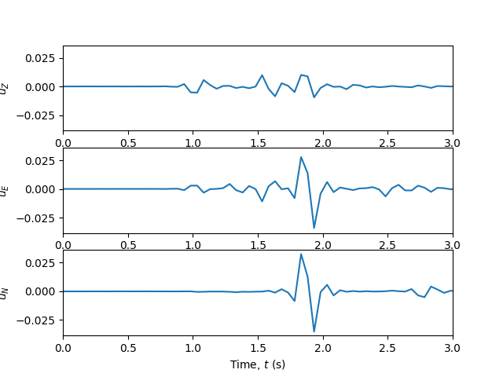

.. fkdrm documentation master file, created by
   sphinx-quickstart on Thu Jan 10 14:33:10 2019.
   You can adapt this file completely to your liking, but it should at least
   contain the root `toctree` directive.

Welcome to fkdrm's documentation!
=================================

FKDRM is intended to provide a simple tool allowing earthquake engineers and seismologists 
to easily use the frequency-wavenumber method (hence FK) to produce ground-motion datasets
for analysis using the Domain Reduction Method (DRM). DRM motions are stored directly
into the H5DRM format.

FK method, the core of FKDRM, is impemented in fortran (originally from http://www.eas.slu.edu/People/LZhu/home.html with
several modifications), and interfaced with python through f2py wrappers. Classes are built on 
top of this wrapper to simplify common modeling tasks such as crustal model specification,
generation of source faults (from simple point sources to full kinematic rupture specifications), 
generating single recording stations, grids and other arrays of recording stations and stations
arranged to meet the requirements of the DRM. Filtering and simple plotting tools are provided
to ease model setup. Finally, computation of motion traces is done by pairing all sources
and all receivers, which is parallelized using MPI. This means that FKDRM can run on 
simple personal computers all the way up to large supercomputing clusters. 

.. contents::

Dependencies
------------

We stand on the shoulder's of giants. `fkdrm` depends on the following python modules (most) 
to work its magic.

- `mpi4py` (optional but highly recommended for parallel computing of the response)
- `h5py`
- `numpy`
- `scipy`
- `matplotlib` (optional, for plotting)
- `tqdm` (optional, for a fancy progressbar)

Get them all with `pip`::

	sudo pip install mpi4py h5py numpy scipy matplotlib tqdm

Installation
------------

For now, only though the git repo::

	git clone git@github.com:jaabell/FKDRM.git

Use the `setup.py` script, using setuptools, to compile and install::

	sudo python setup.py install

If you dont' have `sudo`, you need::

	sudo python setup.py install --user

Build the documenation with::

	sudo python setup.py build_sphinx

Quickstart usage
----------------

Using fkdrm is simple. You need to specify a :obj:`fkdrm.CrustModel` (choose from the available
predefined models or create your own), a :class:`fkdrm.SourceModel` (from a simple 
:class:`fkdrm.Receivers.PointSource` to a complex fully-customizable extended source with :class:`fkdrm.Receivers.MathyFaultPlane`) 
and, finally, a :class:`fkdrm.Receiver` specifying a place to record motions (and store them
in memory or text format).

In this simple example, we specify a simple strike-slip (strike=30, clockwise from north) 
point source at the origin and a depth of 4km, on a custom two-layer crustal model, 
and a single receiver 5km away to the north.

Start by importing the needed components::

	#./doc/examples/example_0_quick_example.py
	from fkdrm import fkdrm
	from fkdrm.CrustModel import CrustModel
	from fkdrm.Sources import PointSource 
	from fkdrm.Receivers import SimpleStation

Create a new two-layer CrustModel::

	crust = CrustModel(2)

	#Slow layer
	Vp=4.000			# P-wave speed (km/s)
	Vs=2.000			# S-wave speed (km/s)
	rho=2.600			# Density (gm/cm**3)
	Qp=10000.			# Q-factor for P-wave
	Qs=10000.			# Q-factor for S-wave
	thickness = 1.0		# Self-explanatory
	crust.add_layer(thickness, Vp, Vs, rho, Qp, Qs)

	#Halfspace
	Vp=6.000
	Vs=3.464
	rho=2.700
	Qp=10000.
	Qs=10000.
	thickness = 0   #Zero thickness --> half space
	crust.add_layer(thickness, Vp, Vs, rho, Qp, Qs)

Specify source location (xyz coordinates: x is north, y is east, z is down, see [:ref:`coordinate-system`])
and strike, dip and rake angles::

	source = PointSource([0,0,4], [30,90,0])

Specify receiver location (xyz as before)::

	receiver = SimpleStation([0,4,0])

These are fed into the FKDRM model class::

	model = fkdrm.fkdrm(crust, source, receiver)

Which is executed::

	model.run()

Results at the station can be readily visualized using the utility function :func:`Tools.Plotting.ZENTPlot`::

	from fkdrm.Tools.Plotting import ZENTPlot
	fig = ZENTPlot(receiver, show=True, xlim=[0,3])

This script can be executed from the command line as follows::

	python example_0_quick_example.py

Yielding:

   Response at receiver station. No source time function was specified, 
   so this is just a Greens function (impulse response) of the
   medium.

Parallel computation capabilities
---------------------------------

To make use of multi-processor architechtures and computer clusters, FKDRM
is parallelized internally using `mpi4py`. Running a script in parallel
processing mode is simply done using an `mpirun` call, no modifications
to the script are necessary::

	mpirun -np 10 python <script-name>

Documentation
==================

.. toctree::
   :maxdepth: 3

   fkdrm

Indices and tables
==================

* :ref:`genindex`
* :ref:`modindex`
* :ref:`search`
