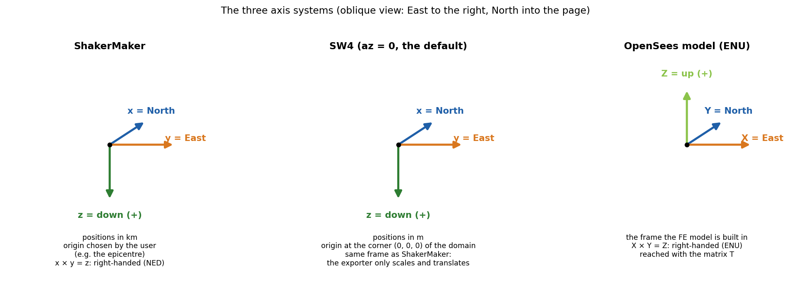
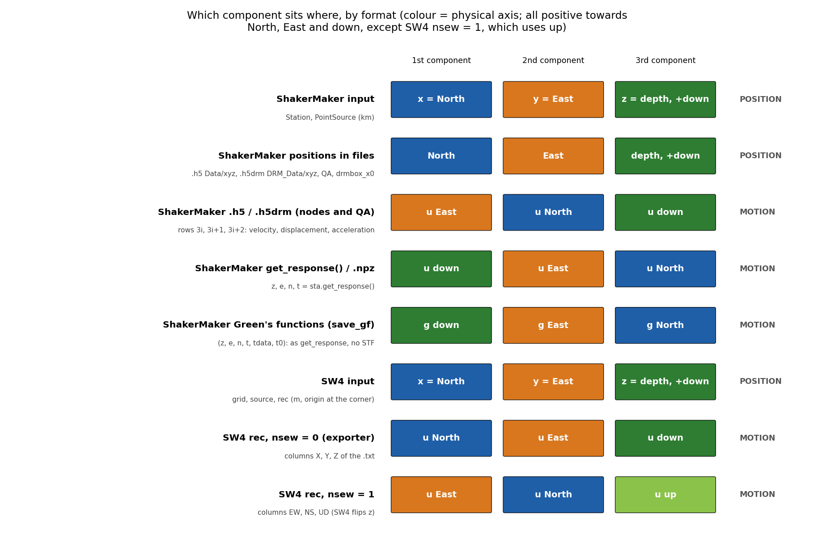
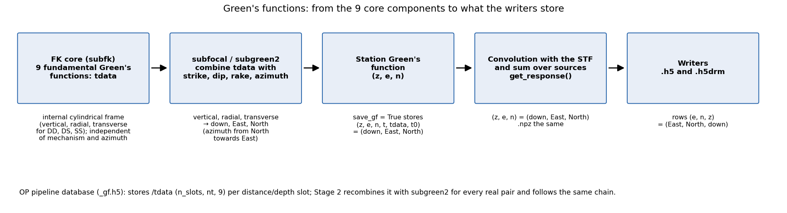
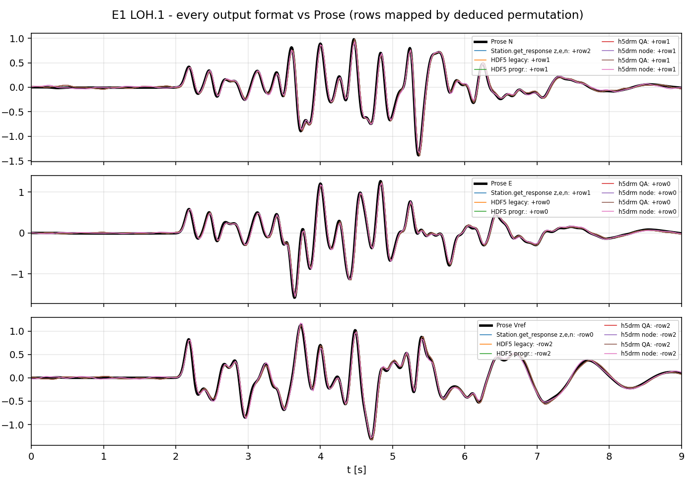
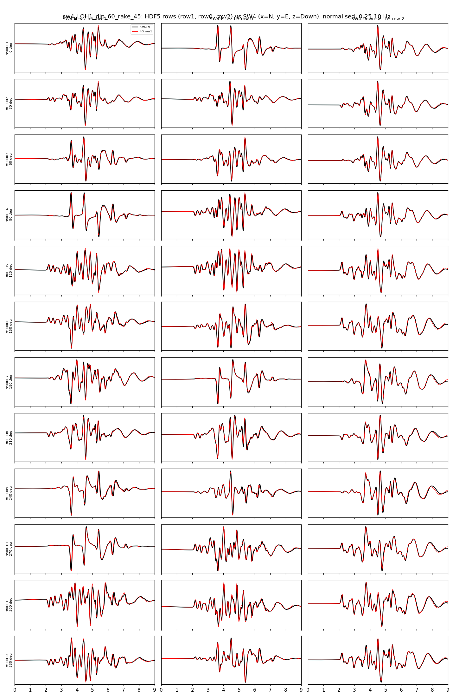

# Coordinates & conventions

ShakerMaker inherits its engine from a seismology code but exposes an
**engineering** convention to the user. The two differ in the sign of the
vertical axis, and getting this right is the difference between a sensible
seismogram and an upside-down one. This page is the single reference for axes,
positions, output components, units, and angles. How the `.h5drm` file is
consumed by OpenSees (the transformation matrix `T`) is covered in the
[DRM guide](../guides/drm.md#using-the-h5drm-in-opensees).

## Two coordinate frames

### The theory frame (Zhu's `fk`)

The FK derivation, and Lupei Zhu's original Fortran, uses the standard
**seismological** frame: a right-handed cylindrical system with the vertical
axis $\mathbf{e}_z$ pointing **upward**. The free surface is at $z = 0$, and a
source at depth $h$ sits at

$$
z_s = -h < 0
$$

i.e. **negative $z$ is down**. This is the convention in every equation of the
[FK method](fk_method.md) page.

### The ShakerMaker frame (what you type)

The Python API flips the vertical axis to the **engineering / structural**
convention, where **depth is positive**:

$$
z_{\text{ShakerMaker}} = +\,\text{depth (down)}
$$

So a source 4 km deep is `PointSource([0, 0, 4], ...)`, a positive `z`. The
engine performs the flip to Zhu's $z$-up frame internally; you never apply it
yourself. **Always give depths as positive numbers.**

!!! warning "The one thing to remember"
    In the **equations**, $z$ is *up* (source at $z = -h$).
    In the **code / your scripts**, $z$ is *down* (source at depth $= +h$).
    Same physics, flipped axis, handled by the engine.

### Horizontal axes

ShakerMaker is right-handed with

$$
x = \text{North}, \qquad y = \text{East}, \qquad z = \text{down}.
$$

A receiver 4 km north of the epicentre is `Station([4, 0, 0])`; 4 km east is
`Station([0, 4, 0])`. This is the **NED** (North–East–Down) frame:
$\hat{x} \times \hat{y} = \hat{z}$.

## ShakerMaker and SW4 use the same frame

SW4 works in a Cartesian box with **x = North, y = East, z = depth (positive
down)**, in metres, with the origin at one corner of the domain. The direction
of the x axis is set by `az` on the `grid` line (azimuth of x from North),
which defaults to 0; the ShakerMaker exporter does not change it. Every SW4
input (`grid`, `source x= y= z=`, `rec x= y= z=`) uses this frame.

It is the **same frame as ShakerMaker**, which is why the
[SW4 exporter](../guides/sw4_export.md) applies a **pure translation** (km → m
and a shift of the origin to the box corner) and no rotation. Source angles are
written unchanged, and the moment tensor is identical in both codes.

*ShakerMaker and SW4 share the NED frame. An OpenSees model is usually built in
ENU (X = East, Y = North, Z = up); getting there is the job of the matrix `T`
described in the [DRM guide](../guides/drm.md#using-the-h5drm-in-opensees).*

## Positions and motion are different things

Two kinds of three-component data appear in ShakerMaker, and they are stored
differently:

- **Positions**: *where* a station, source, or DRM node is.
- **Motion**: *how* that point moves in time (displacement, velocity, or
  acceleration), one time series per axis.

Both have three components, but a file can store them in different orders, and
a downstream transformation can act on one and not on the other. That is
exactly the case of the `.h5drm` file read by OpenSees.

### Positions: always North, East, depth

Every position is stored as it was given, in **(North, East, depth)**, km,
depth positive down. No writer transforms positions.

| Where | Order | Units |
|---|---|---|
| `Station([x, y, z])`, `PointSource([x, y, z], ...)` | (North, East, depth) | km |
| `.npz` (`Station.save`) | (North, East, depth) | km |
| `.h5` → `Data/xyz` | (North, East, depth) | km |
| `.h5drm` → `DRM_Data/xyz`, `DRM_QA_Data/xyz` | (North, East, depth) | km |
| `.h5drm` → `DRM_Metadata/drmbox_x0` and the box bounds | (North, East, depth) | km |

### Motion: the order depends on the output

The motion keeps **the same signs everywhere**, positive towards North, East,
and down, but each output uses a different **order**:

| Output | 1st | 2nd | 3rd |
|---|---|---|---|
| `z, e, n, t = sta.get_response()` and `.npz` | down | East | North |
| Station Green's functions (`save_gf=True`) | down | East | North |
| `.h5` → `Data/{velocity,displacement,acceleration}`, rows `3i, 3i+1, 3i+2` | **East** | **North** | **down** |
| `.h5drm` → `DRM_Data/...` (nodes) and `DRM_QA_Data/...` (QA), same rows | **East** | **North** | **down** |

Velocity, displacement, and acceleration share the same order in every file:
the writers integrate and differentiate each component separately.

*Which component sits in each slot, by format. Colours mark the physical axis,
so a change of colour between two rows is a change of order, never of sign.*

**Green's functions.** There are two levels, and they should not be confused:

1. **The 9 fundamental Green's functions** (`tdata`) computed by the FK core for
   each distance and pair of depths: vertical, radial, and transverse
   responses to three elementary sources (DD, DS, SS), in the core's internal
   cylindrical frame. They do not depend on the mechanism or the azimuth, which
   is why they can be reused; the OP pipeline stores them in `_gf.h5` under
   `/tdata` with shape `(n_slots, nt, 9)`. **They are not physical
   components**: use them only through `subfocal` / `subgreen2`.
2. **The station Green's function**: `subfocal` combines the 9 functions with
   strike, dip, rake, and the station azimuth (from North towards East) and
   rotates the result to (down, East, North). With `metadata={"save_gf": True}`,
   each station stores `(z, e, n, t, tdata, t0)` per source, in the same order
   as `get_response()` but without the source time function.

The kernel produces each station's motion in the **radial–transverse** frame
$(Z, R, T)$ natural to a single source–receiver pair and rotates it to the
**geographic** frame by the source–receiver azimuth $\phi$ (clockwise from
North):

$$
u_E = u_R\sin\phi - u_T\cos\phi, \qquad u_N = u_R\cos\phi + u_T\sin\phi
$$

`ZENTPlot` labels the station components $u_Z, u_E, u_N$ (velocity), or their
integral/derivative for displacement/acceleration.

### Why the `.h5` and `.h5drm` reorder the motion

The writers take `get_response()` and store the rows as **(East, North, down)**.
In ShakerMaker's own axes that is $(u_y, u_x, u_z)$: the two horizontal
components are swapped with respect to the positions, and **no sign is
changed**.

The order is chosen for the consumer of the `.h5drm`, OpenSees'
`H5DRMLoadPattern`, which applies the motion rows **unrotated** to the degrees
of freedom of a model usually built in ENU (X = East, Y = North, Z = up): row 0
lands on X (East) and row 1 on Y (North), and the load pattern flips the
vertical row on read. The positions, on the other hand, are left in
ShakerMaker's frame; OpenSees maps them to the model with its matrix `T`. The
full explanation, with the matrix, is in the
[DRM guide](../guides/drm.md#using-the-h5drm-in-opensees).

### Why the positions are not reordered

Positions are the one thing ShakerMaker keeps uniform: every input and every
file uses (North, East, depth). They are the reference that ties together the
source, the receivers, the DRM box, and the SW4 export. A tool that needs
another frame (such as an OpenSees model) converts them at read time, with a
transformation that it also needs anyway for units (km → m) and origin.

## Comparing with SW4

SW4 station records (`rec ... usgsformat=1`) contain time and three columns:

| `rec` option | Column 2 | Column 3 | Column 4 |
|---|---|---|---|
| `nsew=0` (default, written by the exporter) | u North (x) | u East (y) | u down (z) |
| `nsew=1` | u East | u North | u **up** (SW4 flips z) |

With `nsew=0`, matching ShakerMaker is a pure reordering, with no sign change:

| Physical component | SW4 (`nsew=0`) | ShakerMaker `.h5` / `.h5drm` | ShakerMaker `get_response()` |
|---|---|---|---|
| North | column X | row 1 | `n` |
| East | column Y | row 0 | `e` |
| down | column Z | row 2 | `z` |

## Verification

The convention above was checked against two external references, reading the
stored rows **without relabelling** and deducing, by correlation, which
physical axis each row carries.

*SCEC LOH.1 (receiver 6 km North, 8 km East): every output format
(`get_response`/`.npz`, `.h5` legacy and progressive, `.h5drm` legacy and
progressive, QA and nearest node) against the semi-analytical solution
projected to North, East, and vertical. All formats agree; the analytical
vertical is positive up, hence the minus sign on the down component.*

*A ring of 12 stations at 10 km (one every 30°) around a dip 60° / rake 45°
point source on the LOH.1 crust, against SW4 (x = North, y = East, z = down):
`.h5` row 1 against North, row 0 against East, row 2 against down, with no sign
change. Both traces normalised, 0.25–10 Hz band. ShakerMaker is shifted by
+35 ms: SW4 assigns the layer interface node to the slow layer, which places
its effective interface half a cell deeper and delays its arrivals.*

## Units

ShakerMaker is **not** SI, it uses the units customary in regional seismology.
Be consistent with these everywhere:

| Quantity | Unit | Example |
|---|---|---|
| Length / coordinates | km | `Station([0, 4, 0])` |
| Depth `z` | km, **positive down** | source at `z = 4` |
| P/S velocity | km/s | `vp = 6.0` |
| Density | g/cm³ | `rho = 2.7` |
| Quality factor $Q$ | dimensionless | `qs = 10000.` |
| Time | s | `dt = 0.005` |
| Frequency | Hz | `f0 = 2.0` |
| Angles | degrees | `[strike, dip, rake]` |
| Output motion | velocity — units follow the STF source | `s.z, s.e, s.n` |

## Source angles: strike, dip, rake

The mechanism is the Aki–Richards triple, in **degrees**:

- **Strike** $\phi$, azimuth of the fault trace, clockwise from North (0–360°).
- **Dip** $\delta$, inclination of the fault plane from horizontal (0–90°).
- **Rake** $\lambda$, slip direction of the hanging wall in the fault plane
  (−180–180°): 0° = left-lateral strike-slip, 90° = pure reverse, −90° = pure
  normal.

`PointSource` takes them as `angles=[strike, dip, rake]` and converts to
radians internally.

| Mechanism | `[strike, dip, rake]` |
|---|---|
| Vertical strike-slip | `[90, 90, 0]` |
| Normal (dip-slip) | `[0, 45, -90]` |
| Reverse / thrust | `[0, 45, 90]` |

## Quick reference card

| | Theory (equations) | ShakerMaker (code) | SW4 |
|---|---|---|---|
| Vertical axis | $z$ up, source at $z=-h$ | $z$ down, depth $=+h$ | $z$ down |
| Horizontal | radial $R$, transverse $T$ (per source–receiver pair) | $x$ = North, $y$ = East | $x$ = North, $y$ = East |
| Positions | — | (North, East, depth), km | (North, East, depth), m, origin at a corner |
| Motion | $(Z, R, T)$ kernels | `get_response`: (down, E, N); `.h5`/`.h5drm`: (E, N, down) | `rec nsew=0`: (N, E, down) |
| Angles | strike $\phi$, dip $\delta$, rake $\lambda$ (Aki–Richards) | degrees (Aki–Richards) | degrees, same values |

Back to [**Overview**](overview.md) · on to [**Finite faults & FFSP →**](finite_fault.md).
