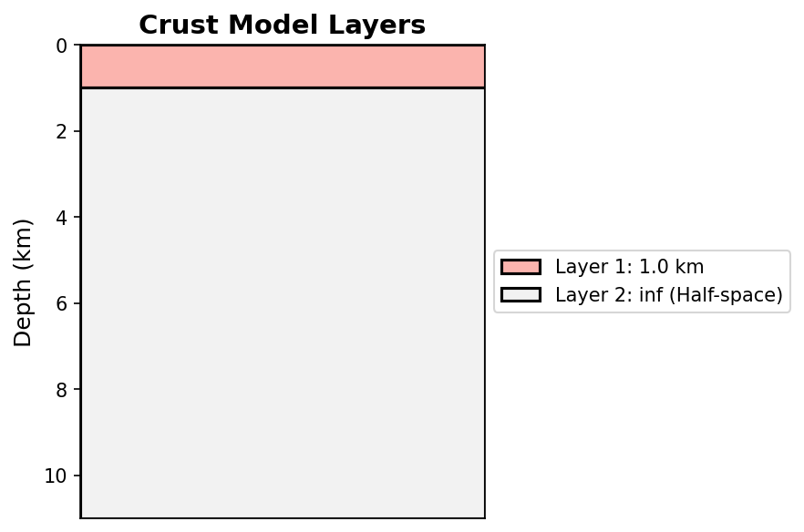
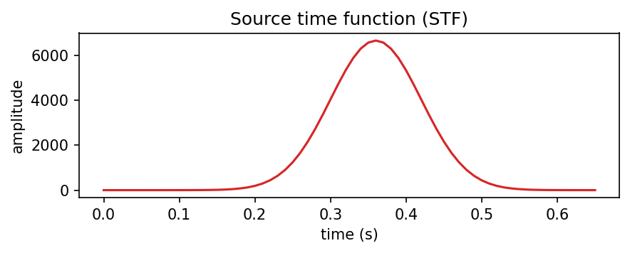
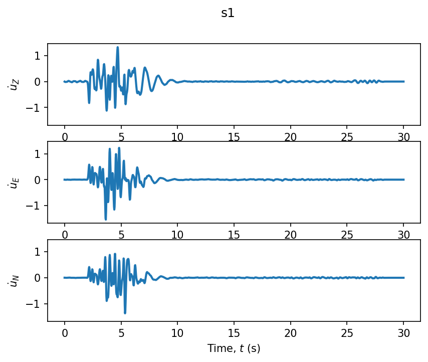

# Exercise 1: First run & the four arrivals

**Goal.** Run the complete FK pipeline end to end, on the validated SCEC LOH.1
setup, and learn to read every figure it produces — the crust, the source, and
the three-component seismogram.

## The model

The benchmark **SCEC LOH.1** medium (a 1 km soft layer over a half-space), a
vertical strike-slip source at 2 km depth driven by a Gaussian source time
function, and one surface station 10 km away.

```python
from shakermaker.shakermaker import ShakerMaker
from shakermaker.cm_library.LOH import SCEC_LOH_1
from shakermaker.pointsource import PointSource
from shakermaker.faultsource import FaultSource
from shakermaker.station import Station
from shakermaker.stationlist import StationList
from shakermaker.stf_extensions.gaussian import Gaussian
from shakermaker.tools.plotting import ZENTPlot

# --- Medium: the SCEC LOH.1 crust (1 km layer over a half-space) ---
crust = SCEC_LOH_1()

# --- Source: vertical strike-slip at 2 km, Gaussian STF ---
sigma  = 0.06                                    # pulse width (s)
M0     = 1e18 / 5e14 / 2                          # scalar moment scaling
stf    = Gaussian(t0=6 * sigma, freq=1 / sigma, M0=M0)
source = PointSource([0, 0, 2], [0., 90., 0.], stf=stf)   # [strike, dip, rake]
fault  = FaultSource([source], metadata={"name": "src"})

# --- Receiver: surface station at (6, 8, 0) km → r = 10 km ---
s1 = Station([6.0, 8.0, 0.0], metadata={"name": "s1"})
stations = StationList([s1], {})

# --- Run ---
model = ShakerMaker(crust, fault, stations)
model.run(dt=0.025, nfft=2048, dk=0.1, tb=1000, tmax=30)

ZENTPlot(s1, xlim=[0, 15], show=True)
```

## Read the inputs first

Before the seismogram, three plots describe what went *in*. Getting used to
reading them is half the skill.

**1 · The crust as layers** (`crust.plot()`) — the stratigraphic column: a
1 km soft surface layer on top of the half-space.

{ width=380 }

**2 · The velocity profile** (`crust.plot_profile()`) — $V_P$, $V_S$ and
density against depth. The jump at 1 km is the layer/half-space contact; that
contrast is what reflects and traps the waves.

{ width=620 }

**3 · The source time function** — how the moment is released in time. Here a
Gaussian pulse (width set by `sigma`, area scaled by `M0`). The FK kernel is
convolved with this, so it sets the source spectrum and the smoothness of the
output.

{ width=520 }

## The result: a three-component seismogram

`ZENTPlot` shows the three velocity components **Z, E, N** at station `s1`:

{ width=620 }

With source–receiver distance $r = \sqrt{6^2 + 8^2} = 10$ km, the classical
arrivals appear in order:

| Arrival | Where it shows | Approx. time | Why |
|---|---|---|---|
| Direct **P** | Z, first onset | $t_P = r/V_P \approx 1.7$ s | fastest body wave |
| Direct **S** | E, N (larger) | $t_S = r/V_S \approx 2.9$ s | slower, stronger |
| **Rayleigh** | Z, radial (late) | $\approx r/(0.92\,V_S) \approx 3.1$ s | surface wave |
| **Love** | transverse | $\sim 3$ s | SH guided by the soft layer |

The bulk of the energy lands between ~2 and ~8 s; after that the trace decays
to zero (the window `tmax=30` is long enough that nothing wraps around — see
[Exercise 2](02_convergence.md)).

## Things to try

1. **Change the mechanism** to pure dip-slip `[0, 45, 90]`; energy shifts off
   the transverse component onto the radial/vertical.
2. **Move the station** to `[12, 16, 0]` ($r = 20$ km); every arrival time
   doubles and the P–S gap widens.
3. **Integrate / differentiate** the trace:
   ```python
   ZENTPlot(s1, integrate=1, show=True)      # velocity → displacement
   ZENTPlot(s1, differentiate=1, show=True)  # velocity → acceleration
   ```

## Checkpoint

You can run the full pipeline, read the crust/STF inputs, and identify P, S,
Rayleigh and Love on the seismogram. Next:
[numerical convergence](02_convergence.md).
