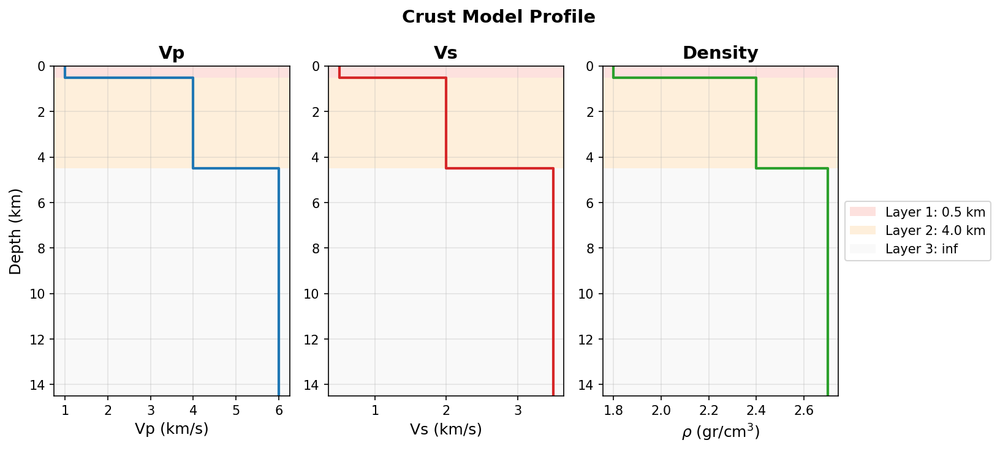

# Exercise 3: A sedimentary basin

**Goal.** Build a realistic multi-layer crust and see how a soft sedimentary
basin amplifies and lengthens ground motion through resonance, the single
most important site effect in engineering seismology.

## The model

Three layers: soft sediment over hard sediment over bedrock. The soft surface
layer (low $V_S$, low $Q$) is what traps and resonates the waves.

```python
from shakermaker.shakermaker import ShakerMaker
from shakermaker.crustmodel import CrustModel
from shakermaker.pointsource import PointSource
from shakermaker.faultsource import FaultSource
from shakermaker.station import Station
from shakermaker.stationlist import StationList
from shakermaker.stf_extensions import Brune
from shakermaker.tools.plotting import ZENTPlot

# --- Basin: soft sediment / hard sediment / bedrock ---
crust = CrustModel(3)
crust.add_layer(0.5, 1.0, 0.5, 1.8,  80.,  50.)    # soft sediment  H = 0.5 km
crust.add_layer(4.0, 4.0, 2.0, 2.4, 300., 200.)    # hard sediment
crust.add_layer(0.0, 6.0, 3.5, 2.7, 1500., 1000.)  # bedrock half-space

# --- Source with a Brune STF (corner frequency 2 Hz) ---
stf    = Brune(f0=2.0, t0=0.0)
source = PointSource([0, 0, 5], [0, 90, 0], stf=stf)
fault  = FaultSource([source], metadata={"name": "basin-source"})

sta = Station([0, 8, 0], metadata={"name": "basin-site"})
stations = StationList([sta], metadata=sta.metadata)

model = ShakerMaker(crust, fault, stations)
model.run(dt=0.005, nfft=4096, dk=0.1, tb=500)

ZENTPlot(sta, xlim=[0, 40], show=True)
```

## What you should see

Compared with Exercise 1's two-layer crust, the basin response is
**longer and more oscillatory**, the soft layer rings after the direct
arrivals. The low $Q_S = 50$ controls how fast that ringing decays.

The three-layer basin profile (`crust.plot_profile()`):

{ width=460 }

The fundamental resonance of a soft layer of thickness $H$ and shear velocity
$V_S$ sits at

$$
f_n \;=\; \frac{(2n+1)\,V_S}{4H}, \qquad n = 0, 1, 2, \dots
$$

For $H = 0.5$ km and $V_S = 0.5$ km/s, the fundamental is $f_0 = 0.25$ Hz.
Inspect the velocity spectrum to find the peaks:

```python
import numpy as np, matplotlib.pyplot as plt
z, e, n, t = sta.get_response()
dt = t[1] - t[0]
f  = np.fft.rfftfreq(len(z), dt)
plt.semilogx(f, np.abs(np.fft.rfft(z)))
plt.xlabel("f (Hz)"); plt.ylabel("|U_Z(f)|")
plt.axvline(0.25, ls="--"); plt.axvline(0.75, ls="--")  # f0, f1
plt.show()
```

Peaks should align with $f_0 = 0.25$ Hz and $f_1 = 0.75$ Hz.

## Things to try

1. **Stiffen the basin**, raise the soft-layer $V_S$ to 1.0 km/s; the
   resonance moves up to $f_0 = 0.5$ Hz and the motion shortens.
2. **Raise $Q_S$** of the soft layer to 500, the ringing decays faster.
3. **Use the preset** `AbellThesis()` crust for a regional Chilean profile and
   compare.

## Checkpoint

You can build an arbitrary layered crust, predict its fundamental resonance,
and see it in the spectrum. Next:
[source time functions compared](04_stf.md).
