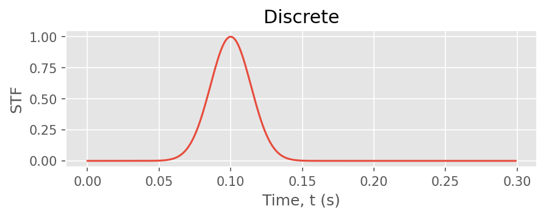

# Exercise 4: Source time functions compared

**Goal.** Understand how the source time function (STF) shapes the spectrum,
and how to choose one for a target frequency band.

## The idea

The FK kernel computes the **impulse** (Dirac) response. The STF is convolved
with it afterwards, so the *same* Green's function can be reused with many
STFs. The STF controls the source spectrum: a sharper pulse → more
high-frequency content.

## Compare the STFs in the time and frequency domains

```python
import numpy as np, matplotlib.pyplot as plt
from shakermaker.stf_extensions import Dirac, Brune, Gaussian

dt = 0.01
stfs = {
    "Dirac":          Dirac(),
    "Brune f0=1 Hz":  Brune(f0=1.0, t0=0.0),
    "Brune f0=3 Hz":  Brune(f0=3.0, t0=0.0),
    "Gaussian":       Gaussian(t0=0.5, freq=4.0),
}

fig, (ax1, ax2) = plt.subplots(1, 2, figsize=(11, 4))
for name, stf in stfs.items():
    stf.dt = dt                       # set the sampling step
    t, s = stf.t, stf.data            # the discretised STF
    ax1.plot(t, s / s.max(), label=name)
    f = np.fft.rfftfreq(len(s), dt)
    S = np.abs(np.fft.rfft(s))
    ax2.loglog(f, S / S.max(), label=name)
ax1.set_xlim(0, 2); ax1.set_xlabel("t (s)"); ax1.set_title("time")
ax2.set_xlabel("f (Hz)"); ax2.set_title("spectrum"); ax2.legend()
plt.show()
```

## What you should see

The built-in STFs, each on its own (time domain):

| Dirac | Brune |
|---|---|
|  |  |
| **Gaussian** | **Discrete** |
|  |  |

How each maps to the source spectrum:

| STF | Time domain | Spectrum |
|---|---|---|
| `Dirac` | a single spike | flat (all frequencies) |
| `Brune` (low `f0`) | broad pulse | rolls off early, low-frequency source |
| `Brune` (high `f0`) | sharp pulse | extends to higher frequency |
| `Gaussian` | smooth bump | band-limited, no high-frequency tail |

The Brune **corner frequency** `f0` is the knee of the spectrum: below it the
spectrum is flat, above it it falls as $\omega^{-2}$. Larger earthquakes have
*lower* corner frequencies.

## Choosing one

For an $M_w\,6$ event with a target engineering band of 0.5–10 Hz, a Brune
STF with a corner near 0.3–0.5 Hz delivers realistic high-frequency content
without the artificial flatness of a Dirac. Use a Gaussian when you want a
smooth, strictly band-limited pulse (e.g. validation against a known input).

## Run the built-in gallery

```bash
python examples/03_stf/stf_gallery.py     # instantiates all five STFs
```

This reproduces the [STF gallery](../guides/source_time_functions.md#the-full-gallery).

## Checkpoint

You can predict the spectral shape of each STF and pick one for a target
band. Next: [DRM box → H5DRM](05_drm.md).
