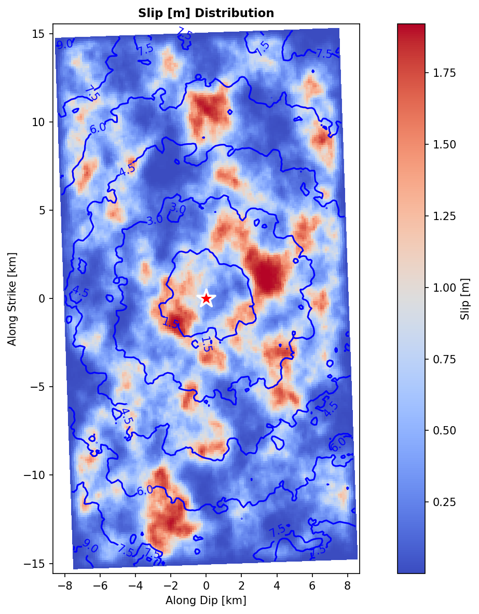
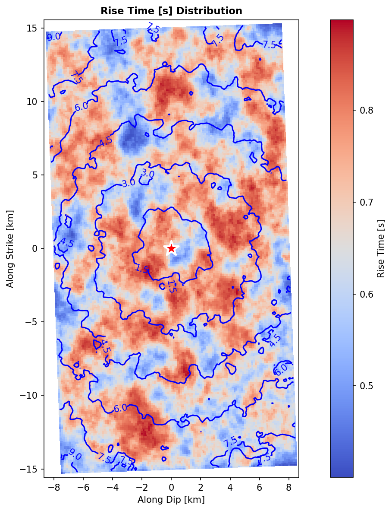

# Exercise 6: FFSP stochastic rupture

**Goal.** Generate an ensemble of physically-admissible stochastic ruptures
for a scenario earthquake, inspect the slip distribution, and export it. This
is the source generator behind probabilistic ground-motion studies.

## The idea

A future earthquake's slip is unknowable in detail, so instead of one rupture
we generate **many** that all honour the same magnitude, geometry and target
spectrum but differ in their random fields (slip, rise time, rupture
velocity…). See [the background](../background/finite_fault.md#why-stochastic-ffsp).

## The model

```python
from shakermaker.ffspsource import FFSPSource
from shakermaker.crustmodel import CrustModel

# --- Medium ---
crust = CrustModel(1)
crust.add_layer(0.0, 6.0, 3.5, 2.7, 1000., 1000.)

# --- Scenario: Mw 6.5 on a 30 x 16 km fault ---
source = FFSPSource(
    id_sf_type=8, freq_min=0.01, freq_max=24.0,
    fault_length=30.0, fault_width=16.0,
    x_hypc=15.0, y_hypc=8.0, depth_hypc=10.0, xref_hypc=0.0, yref_hypc=0.0,
    magnitude=6.5, fc_main_1=0.1, fc_main_2=0.3,
    rv_avg=2.6, ratio_rise=0.2,
    strike=358.0, dip=40.0, rake=113.0, pdip_max=5.0, prake_max=10.0,
    nsubx=256, nsuby=128, nb_taper_trbl=[5, 5, 5, 5],
    seeds=[1, 2, 3], id_ran1=1, id_ran2=50,     # 50 realisations
    angle_north_to_x=0.0, is_moment=1,
    crust_model=crust,
)

# --- Generate the ensemble ---
source.run()                       # MPI-aware; produces id_ran1..id_ran2 realisations
```

## Inspect the result

```python
# the best (lowest-PDF-score) realisation is selected automatically
source.plot_spacial_distribution(field='slip')     # slip map on the fault
source.plot_rupture_snapshot(time_snapshot=3.0)     # rupture front at t = 3 s
source.plot_quality_metrics()                       # ensemble scoring
source.plot_spectral_comparison()                   # spectrum vs target

# pick a specific realisation
source.set_active_realization(7)
sub = source.get_subfaults()
```

**What you should see.** The slip map shows one or two **asperities** (high-slip
patches) on an otherwise lower-slip plane, the heterogeneity that drives
realistic high-frequency radiation. The rupture snapshot shows the front
expanding outward from the hypocentre. The spectral plot should track the
double-corner-frequency target between `fc_main_1` and `fc_main_2`.

| Slip distribution | Rise-time distribution |
|---|---|
|  |  |

*Reproduce (a small 64 × 32 version) with [`gen_ffsp.py`](../examples/index.md#generating-the-figures).*

## Export

```python
source.write_hdf5("ffsp_mw65.h5")            # reload with FFSPSource.from_hdf5(...)
source.write_ffsp_format("FFSP_OUTPUT")      # legacy text format
```

## Resolution check

Keep subfaults smaller than the shortest wavelength: with `nsubx=256` on a
30 km fault, $\Delta\xi = 30/256 \approx 0.12$ km, fine enough for
$f_\text{max}\,V_S^{-1}$ at engineering bands (rule:
$\Delta\xi \lesssim V_S^\text{min}/(5\,f_\text{max})$).

## From rupture to ground motion

The FFSP rupture becomes a `FaultSource` of subfaults, each with its slip,
mechanism and rupture time, which you then feed to `ShakerMaker.run` exactly
as in the earlier exercises, the Green's functions are shared across all
realisations, so the per-realisation cost is small.

## Checkpoint

You can generate, inspect and export a stochastic rupture ensemble. You have
now used every major input ShakerMaker offers, see the
[API reference](../api/index.md) for the complete surface.
