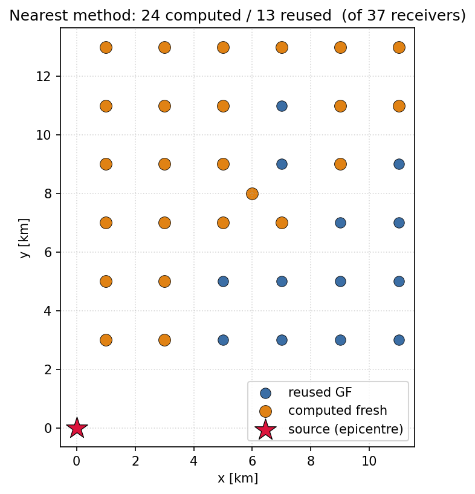

# Exercise 7: Receiver geometries & the fast pipeline

**Goal.** Build a production-style run: a half-space model, a Gaussian source,
a *grid* of receivers (not just one station), and the optimised three-stage
pipeline `run_nearest` writing straight to an `.h5drm` file. This is the
pattern most real ShakerMaker scripts follow.

By the end you will understand **which receiver geometry to pick**, **what the
clustering tolerances do**, and **why the OP pipeline is the right tool** the
moment you have more than a few receivers.

## The full script

```python
from shakermaker import shakermaker
from shakermaker.crustmodel import CrustModel
from shakermaker.pointsource import PointSource
from shakermaker.faultsource import FaultSource
from shakermaker.stf_extensions.gaussian import Gaussian
from shakermaker.slw_extensions import DRMHDF5StationListWriter
from shakermaker.sl_extensions.SurfaceGrid import SurfaceGrid

# --- 1. Medium: a soft layer over a half-space ---
crust = CrustModel(2)
crust.add_layer(1.0, 4.0, 2.0,   2.6, 10000., 10000.)   # d, vp, vs, rho, Qp, Qs
crust.add_layer(0.0, 6.0, 3.464, 2.7, 10000., 10000.)   # half-space (d = 0)

# --- 2. Source: a Gaussian-pulse strike-slip at 2 km depth ---
M0    = 1e18 / 5e14 / 2          # scalar moment scaling
sigma = 0.06                     # pulse width parameter
t0    = 6 * sigma                # pulse onset
source = PointSource([0, 0, 2.0], [0., 90., 0.],
                     stf=Gaussian(t0=t0, freq=1/sigma, M0=M0, derivative=False))
fault  = FaultSource([source], metadata={"name": "halfspace_source"})

# --- 3. Receivers: a hollow box of stations around the site ---
x_site = [6.0, 8.0, 0.0]                 # box centre (km): x=N, y=E, z=down
Lx = Ly = 110/1000                       # box side lengths (km)
Lz = 35/1000
dx = 10/1000                             # station spacing (km)
nx, ny, nz = int(Lx/dx), int(Ly/dx), int(Lz/dx)

stations = SurfaceGrid(x_site, [nx, ny, nz], [dx, dx, dx],
                       mode='hollow', metadata={"name": "DRM_shell"})
folder = 'DRM_shell'

# --- 4. The model ---
model = shakermaker.ShakerMaker(crust, fault, stations)

# --- 5. The optimised pipeline, straight to H5DRM ---
gf_db  = f'./{folder}/gf_database_{dx*1000:.0f}m.h5'
out    = f'./{folder}/Surface_{dx*1000:.0f}m.h5drm'
writer = DRMHDF5StationListWriter(out)

model.run_nearest(
    stage='all',
    h5_database_name=gf_db,
    # Stage 0: geometry clustering
    delta_h=2.5e-3, delta_v_rec=2.5e-3, delta_v_src=2.5e-3, npairs_max=100000,
    # Core numerical parameters
    dt=0.005, nfft=2048*2, dk=0.05, tb=20, smth=1,
    # Stage 2: output
    writer=writer, writer_mode='progressive',
    verbose=False, debugMPI=False, showProgress=True,
)
```

Run it (one rank per core):

```bash
mpirun -np 8 python main_halfspace_surface.py
```

## Block by block

### 1 · The medium

Two layers, a 1 km soft surface layer over a half-space (the `d = 0` layer).
`Q = 10000` makes it essentially elastic. (See [Crust model](../guides/crust_model.md).)

### 2 · The Gaussian source

A strike-slip mechanism `[0, 90, 0]` at 2 km depth, driven by a **Gaussian**
source time function. `Gaussian(t0, freq, M0)` sets the pulse onset, its
inverse width (`freq = 1/sigma`), and the moment scaling. Use a Gaussian when
you want a smooth, band-limited input, handy for clean, reproducible tests.

### 3 · The receivers: pick your geometry

This is the heart of the exercise. The **same** `(centre, counts, spacing)`
inputs feed several factories; swap one block to change the layout. The site
centre `x_site = [6, 8, 0]` is in km with `x = North, y = East, z = down`.

=== "Hollow box (DRM shell)"

    ```python
    from shakermaker.sl_extensions.SurfaceGrid import SurfaceGrid
    stations = SurfaceGrid(x_site, [nx, ny, nz], [dx, dx, dx], mode='hollow',
                           metadata={"name": "DRM_shell"})
    ```
    Only the **faces** of the box, the cheapest way to capture a DRM
    boundary.

=== "Surface map (XY plane)"

    ```python
    stations = SurfaceGrid([4, 4, 0], [nx, ny, 1], [dx, dx, dx],
                           mode='plane', plane_z=0.0,
                           metadata={"name": "surface_map"})
    ```
    A flat sheet on the free surface, a shake-map of the site.

=== "Cross-section (XZ / YZ)"

    ```python
    stations = SurfaceGrid(x_site, [nx, ny, nz], [dx, dx, dx],
                           mode='plane', plane_y=8.0,   # or plane_x=6.0
                           metadata={"name": "xz_section"})
    ```
    A vertical slice, see how motion varies with depth.

=== "Full DRM box"

    ```python
    from shakermaker.sl_extensions import DRMBox
    stations = DRMBox(x_site, [nx, ny, nz], [dx, dx, dx],
                      metadata={"name": "DRM_box"})
    ```
    The proper Bielak DRM box (interior + exterior ring), ready for OpenSees.

=== "Point cloud (from FEM)"

    ```python
    from shakermaker.sl_extensions import PointCloudDRMReceiver
    stations = PointCloudDRMReceiver(
        point_cloud_file='./drm_nodes.txt',
        crd_scale=1/1e6,            # mm -> km
        x0_fem=[22000., 15500., 0.],
        drmbox_x0=x_site,
        metadata={"name": "PointCloud_DRM"})
    ```
    Receivers read straight from a FEM mesh export, arbitrary positions.

Three of those layouts, drawn with `StationPlot`:

| Surface grid | DRM box | Hollow shell |
|---|---|---|
|  |  |  |

The number of stations follows from `nx = int(Lx/dx)`. Halving `dx`
quadruples a surface grid and roughly doubles a hollow shell, which is
exactly why the next step matters.

### 4 · The model

`ShakerMaker(crust, fault, stations)` binds the three ingredients. Nothing is
computed yet.

### 5 · `run_nearest`: the optimised pipeline

With thousands of receivers, computing every (source, receiver) pair is
wasteful: most pairs share the same *geometry* and therefore the same Green's
functions. `run_nearest` exploits that in three stages
([full reference](../guides/running.md#the-op-pipeline-run_nearest)):

- **Stage 0** clusters all pairs into unique-geometry **slots**. The
  tolerances decide how close two pairs must be to count as one:
  `delta_h` (horizontal distance), `delta_v_rec` (receiver depth),
  `delta_v_src` (source depth). *Smaller* tolerances → more, stricter slots
  (more exact, more kernel calls); *larger* → fewer slots (faster, more
  reuse). `npairs_max` caps how many pairs are held in memory per batch.
- **Stage 1** runs the FK kernel **once per slot**, saving the Green's
  functions to `<db>_gf.h5`.
- **Stage 2** assembles each station's seismogram (recombine mechanism +
  azimuth, convolve the STF) and streams it to the `writer`.

`h5_database_name` is the **root**; the pipeline writes `<root>_map.h5` and
`<root>_gf.h5`. Because the Green's-function database persists, you can re-run
**only Stage 2** (`stage=2`) later, e.g. to add stations or change the output
window, without recomputing the kernel.

`writer_mode='progressive'` flushes each station to the `.h5drm` and frees its
memory immediately, so even a large box runs in O(1) RAM.

The payoff is visible: for a 6×6 surface array, the pipeline computes the
kernel fresh only where the geometry is new (orange) and **reuses** it
everywhere a near-enough slot already exists (blue) — here 13 of 37 receivers
are served from cache:

{ width=520 }

## What you get

A file `Surface_10m.h5drm` with three-component velocity, displacement and
acceleration at every station, plus the geometry, exactly the
[H5DRM layout](../guides/drm.md#the-h5drm-file) OpenSees reads. Inspect it:

```bash
h5ls -r DRM_shell/Surface_10m.h5drm
```

## Checkpoint

You can choose a receiver geometry for the job, size it, and drive the OP
pipeline to a ready-to-use `.h5drm`. This is the template for real DRM
production runs. Back to the [exercise index](index.md).
