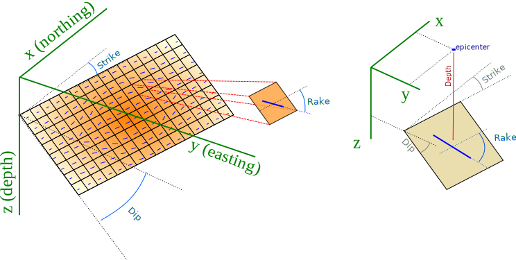
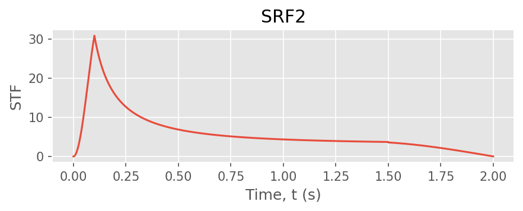

# Exercise 8: Sources — point & finite faults

**Goal.** Build the two source types ShakerMaker accepts: a single
`PointSource` with a mechanism and an STF, and a `FaultSource` — a grid of
point sources that together make an extended (finite) fault.
(Examples: [`02_sources/`](../examples/index.md#02-sources).)

## A single point source

A `PointSource` needs a location `[x, y, z]` (km), a mechanism
`[strike, dip, rake]` (degrees, Aki–Richards), and an STF:

```python
from shakermaker.cm_library.LOH import SCEC_LOH_1
from shakermaker.pointsource import PointSource
from shakermaker.faultsource import FaultSource
from shakermaker.stf_extensions.gaussian import Gaussian

crust = SCEC_LOH_1()

sigma = 0.06
stf   = Gaussian(t0=6 * sigma, freq=1 / sigma, M0=1e18 / 5e14 / 2)

source = PointSource([0, 0, 2], [0, 90, 0], stf=stf)   # [x,y,z] km ; [strike,dip,rake] deg
fault  = FaultSource([source], metadata={"name": "pointsource"})
```

The mechanism is the only thing that changes the *radiation pattern*; see the
[mechanism cheat-sheet](../guides/sources.md) (and the interactive block model
there) for what `[strike, dip, rake]` mean physically.

## A finite fault: a grid of subfaults

An extended rupture is just **many** `PointSource` objects collected into one
`FaultSource`. Each subfault carries its own position, mechanism, slip (via its
STF) and rupture time `tt`. Here a 2×5 grid with `SRF2` slip-rate functions and
randomised rake/slip:

```python
import numpy as np
from shakermaker.pointsource import PointSource
from shakermaker.faultsource import FaultSource
from shakermaker.stf_extensions.srf2 import SRF2

rng = np.random.default_rng(0)             # fixed seed -> reproducible
x0, y0, z0 = 0.0, 0.0, 3.0
dx, dz = 0.5, 0.5                          # subfault spacing (km)
strike, dip = 0.0, 90.0

sources = []
for i in range(2):                         # 2 along-strike
    for j in range(5):                     # 5 down-dip -> 10 subfaults
        x = x0 + i * dx
        z = z0 + j * dz                    # deeper down-dip
        rake = rng.uniform(-10, 10)        # deg
        slip = rng.uniform(0.5, 1.5)       # m
        stf  = SRF2(Tr=2.0, Tp=0.1, Te=1.5, dt=0.01, slip=slip, a=1.0, b=1.0)
        sources.append(PointSource([x, y0, z], [strike, dip, rake], stf=stf))

fault = FaultSource(sources, metadata={"name": "fault_srf2"})
assert fault.nsources == 10
```

The geometry of an extended fault (strike/dip plane, sub-source grid):

{ width=460 }

The `SRF2` slip-rate function used per subfault (rise time `Tr`, peak time
`Tp`, end time `Te`):

{ width=460 }

## Things to try

1. **Stagger the rupture timing**: give each subfault a `tt` increasing with
   distance from the hypocentre (`tt = dist / rupture_velocity`) to model a
   propagating rupture.
2. **Swap the STF** per subfault (`Brune`, `Gaussian`) and compare the radiated
   spectrum.
3. For a *physically-generated* finite fault (stochastic slip, rise time and
   rupture velocity), use [`FFSPSource`](06_ffsp.md) instead of hand-building
   the grid.

## Checkpoint

You can build a point source with any mechanism and assemble a finite fault
from a grid of subfaults. Next: feed them to the
[engine](01_first_run.md) or the [fast pipeline](07_receivers_pipeline.md).
