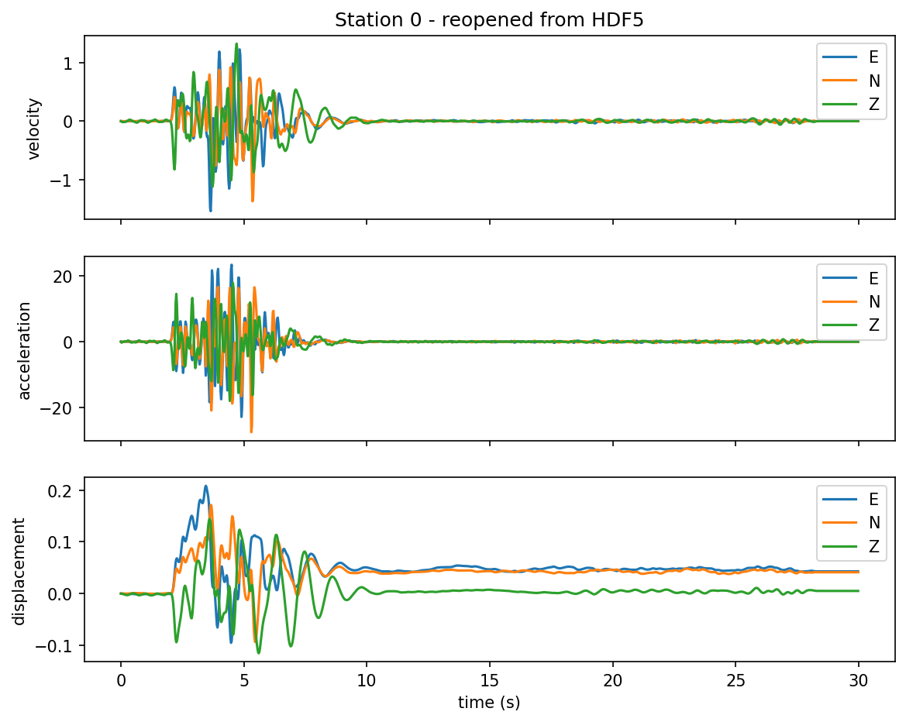

# Exercise 9: Saving results & writers

**Goal.** Persist a run three ways — a single-station `.npz`, an aggregate
HDF5, and the progressive HDF5 that scales to thousands of stations — and read
them back. (Examples: [`07_writers/`](../examples/index.md#07-writers-io).)

## Save and reload one station (`.npz`)

The simplest persistence: run once, save, reload into a fresh `Station`.

```python
from shakermaker.shakermaker import ShakerMaker
from shakermaker.cm_library.LOH import SCEC_LOH_1
from shakermaker.pointsource import PointSource
from shakermaker.faultsource import FaultSource
from shakermaker.station import Station
from shakermaker.stationlist import StationList
from shakermaker.stf_extensions.gaussian import Gaussian

crust  = SCEC_LOH_1()
stf    = Gaussian(t0=0.36, freq=1 / 0.06, M0=1e18 / 5e14 / 2)
source = PointSource([0, 0, 2], [0, 90, 0], stf=stf)
fault  = FaultSource([source], metadata={"name": "src"})

s = Station([6, 8, 0], metadata={"name": "sta01"})
model = ShakerMaker(crust, fault, StationList([s], {}))
model.run(dt=0.025, nfft=2048, tb=1000, dk=0.1, tmax=30)

s.save("sta.npz")                 # write
s2 = Station(); s2.load("sta.npz")  # read into a fresh station
```

The `.npz` keeps the location, metadata, the three components and the time
vector — everything needed to plot later without re-running.

## Stream many stations to HDF5

For more than a handful of stations, attach a `writer=` and the responses
stream to one file as they are computed:

```python
from shakermaker.slw_extensions import HDF5StationListWriter

s1 = Station([6, 8, 0], metadata={"name": "sta01"})
s2 = Station([8, 8, 0], metadata={"name": "sta02"})
model = ShakerMaker(crust, fault, StationList([s1, s2], {}))

# legacy: everything written at close()
writer = HDF5StationListWriter("out_legacy.h5")
model.run(dt=0.025, nfft=2048, tb=1000, dk=0.1, tmax=30,
          writer=writer, writer_mode="legacy")

# progressive: each station flushed immediately, O(1) RAM
writer = HDF5StationListWriter("out_progressive.h5")
model.run(dt=0.025, nfft=2048, tb=1000, dk=0.1, tmax=30,
          writer=writer, writer_mode="progressive")
```

Both files carry **velocity, acceleration and displacement** (the last two
differentiated/integrated at write time) for every station. Reopened from
HDF5, station 0 looks like this:

{ width=680 }

See [Outputs & writers](../guides/outputs.md) for the full file structure
(`/Data`, `/Metadata`, the E-N-Z row ordering) and the `legacy` vs
`progressive` trade-off.

## Inspect any file

`explore_h5_output.py` walks an `.h5` / `.h5drm` and prints every group and
dataset with its shape — handy when wiring the output into another tool:

```bash
python examples/07_writers/explore_h5_output.py
```

## Checkpoint

You can persist a run as `.npz` or HDF5 and reload it, and you know when to
reach for `progressive` mode. For the DRM-flavoured writer, continue to
[Exercise 5](05_drm.md).
