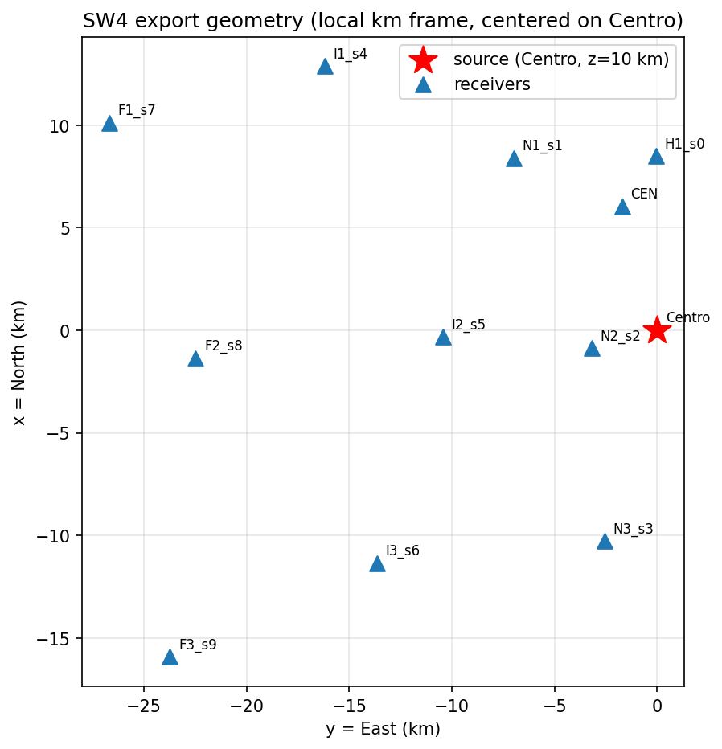
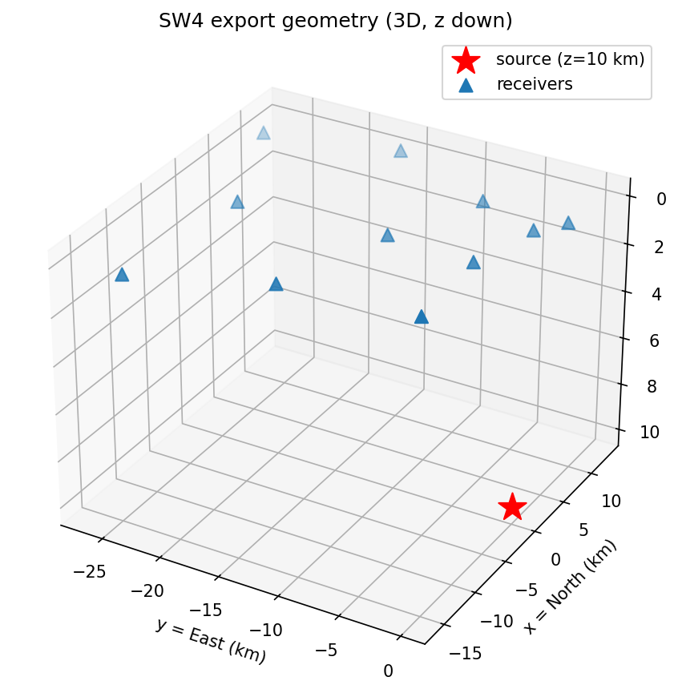

# Exercise 10: Exporting to SW4

**Goal.** Hand a ShakerMaker model — crust, source and receivers — to the
**SW4** finite-difference solver, so the regional FK model and a 3-D SW4 box
share the same source and geometry. (Examples:
[`09_sw4_export/`](../examples/index.md#09-sw4-export).)

## The idea

ShakerMaker is the *master* frame (georeferenced, km). SW4 works in its own
local box, in metres. `export_sw4` performs a pure translation (no rotation),
writes the SW4 source(s) and the receiver list, and bundles everything into a
single HDF5 package you unpack next to your SW4 run.

## The model

A real station network: UTM coordinates converted to a local km frame centred
on the source (“Centro”), a 4-layer crust, and a single point source at 10 km
depth.

```python
from shakermaker.shakermaker import ShakerMaker
from shakermaker.crustmodel import CrustModel
from shakermaker.pointsource import PointSource
from shakermaker.faultsource import FaultSource
from shakermaker.station import Station
from shakermaker.stationlist import StationList
from shakermaker.stf_extensions.gaussian import Gaussian

# UTM (m) -> local km, x=North, y=East, centred on the source.
# x_km = (utmy - utmy0)/1000 ; y_km = (utmx - utmx0)/1000

crust = CrustModel(4)
crust.add_layer(0.200, 1.32, 0.75, 2.40, 1000., 1000.)
crust.add_layer(0.800, 2.75, 1.57, 2.50, 1000., 1000.)
crust.add_layer(14.500, 5.50, 3.14, 2.50, 1000., 1000.)
crust.add_layer(0.000, 7.00, 4.00, 2.67, 1000., 1000.)

stf = Gaussian(t0=0.36, freq=16.6667, M0=1.0); stf.dt = 0.01
src = PointSource([0.0, 0.0, 10.0], [0., 90., 0.], stf=stf)
fault = FaultSource([src], metadata={"name": "centro_source"})

# ... Station(...) for each network site (skip the source location) ...
model = ShakerMaker(crust, fault, stationlist)

model.export_sw4(path="_sw4_out", h=50, tmax=50, plot_geometry=True)
```

## What you get

`export_sw4` writes a `sw4_package.h5` bundle plus an `unpack_sw4_package.py`
helper. Unpacking produces the SW4 input tree (`shakermaker2sw4.in`, the
`sources/`, and topography if any). With `plot_geometry=True` it also draws the
layout so you can sanity-check positions before launching SW4.

**Plan view** — source (Centro) and receivers in the local km frame:

{ width=520 }

**3-D view** — the same geometry with depth:

{ width=520 }

## With topography

`export_sw4_topo` does the same but reads a Cartesian SW4 topography file
(`x=East, y=North`), rotates it into the ShakerMaker frame, and extends it to
the domain. See [the SW4 export guide](../guides/sw4_export.md) for the bundle
layout and the coordinate convention.

## The round trip

After SW4 runs, build an `.h5drm` *from* the SW4 case with
[`examples/09_sw4_export/build_h5drm_from_sw4_case.py`](../examples/index.md#09-sw4-export)
— SW4-local-km ↔ ShakerMaker/UTM-km conversion included.

## Checkpoint

You can export a model to SW4, inspect the geometry, and close the loop back to
an `.h5drm`. Next: the [SW4 export guide](../guides/sw4_export.md) for every
knob.
