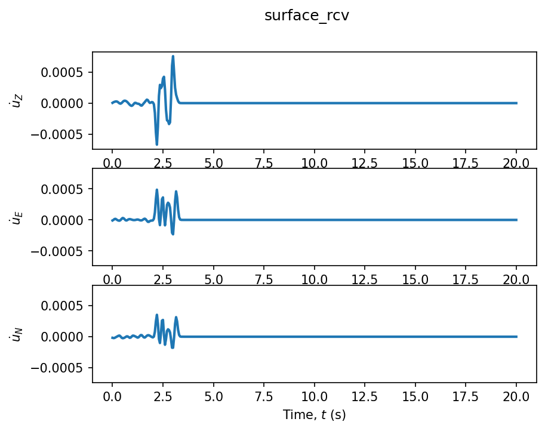

# Exercise 11: Plotting & visualisation

**Goal.** Use ShakerMaker's three built-in plot helpers — `ZENTPlot` for
seismograms, `StationPlot` for receiver geometry, and `SourcePlot` for source
geometry. (Examples: [`11_plotting/`](../examples/index.md#11-plotting).)

## Seismograms: `ZENTPlot`

The workhorse. Given a `Station` with a response, it draws the three
components Z, E, N, and can integrate or differentiate on the fly:

```python
from shakermaker.tools.plotting import ZENTPlot

ZENTPlot(sta, xlim=[0, 20], show=True)                  # velocity
ZENTPlot(sta, xlim=[0, 20], integrate=1, show=True)     # displacement
ZENTPlot(sta, xlim=[0, 20], differentiate=1, show=True) # acceleration
ZENTPlot(sta, savefigname="seismo.png")                 # save instead of show
```

{ width=620 }

Other handy arguments: `label=` to overlay traces from several runs on one
figure (call `ZENTPlot` repeatedly with the same `fig=`), and `linestyle` /
`linewidth` for styling.

## Geometry: `StationPlot` and `SourcePlot`

`StationPlot(stations)` scatters a `StationList` in 3-D — most useful for an
*array* of receivers (a single station is just a dot). The
[receiver-geometry gallery](07_receivers_pipeline.md) shows it at work across
`SurfaceGrid`, `DRMBox` and point clouds:

{ width=720 }

`SourcePlot(sources, colorby="maxstf", colorbar=True)` scatters a
`FaultSource`, colouring each subfault by a field (slip, peak STF, …). It comes
into its own for a finite fault with many subfaults — for a single point source
it is just one coloured dot.

```python
from shakermaker.tools.plotting import StationPlot, SourcePlot

StationPlot(stations, show=True)
SourcePlot(fault, colorby="maxstf", colorbar=True, show=True)
```

!!! note "MPI"
    All three helpers only draw on rank 0, so they are safe to call inside an
    MPI run without every rank popping a window.

## Checkpoint

You can plot a seismogram (and its integral/derivative), an array of
receivers, and a coloured fault. Full signatures in the
[plotting guide](../guides/plotting.md).
