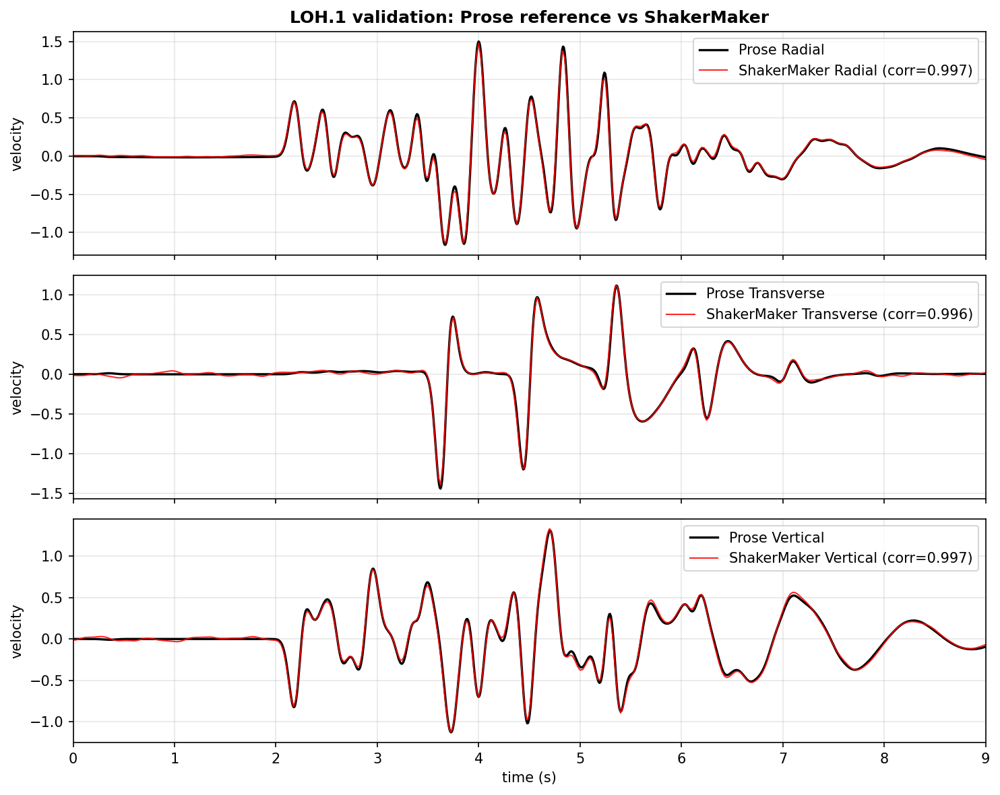
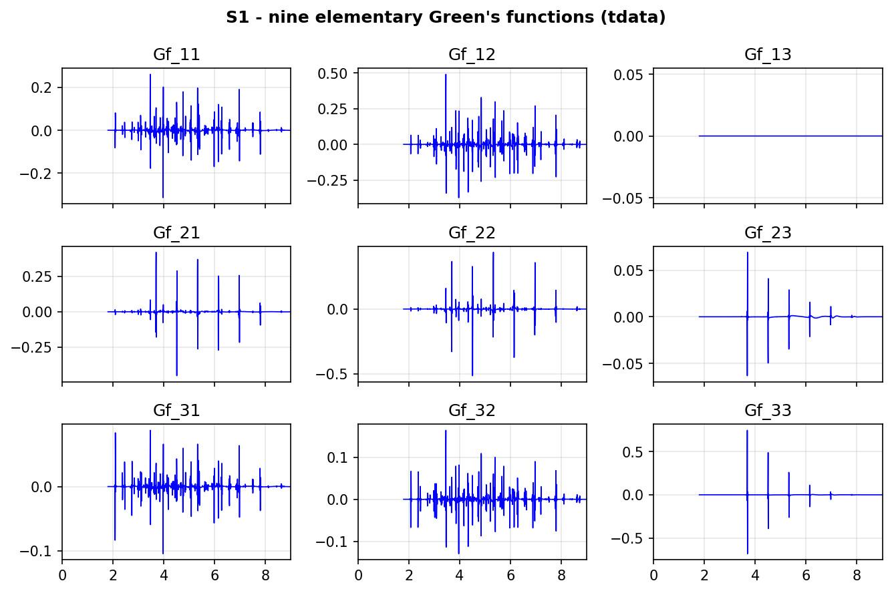
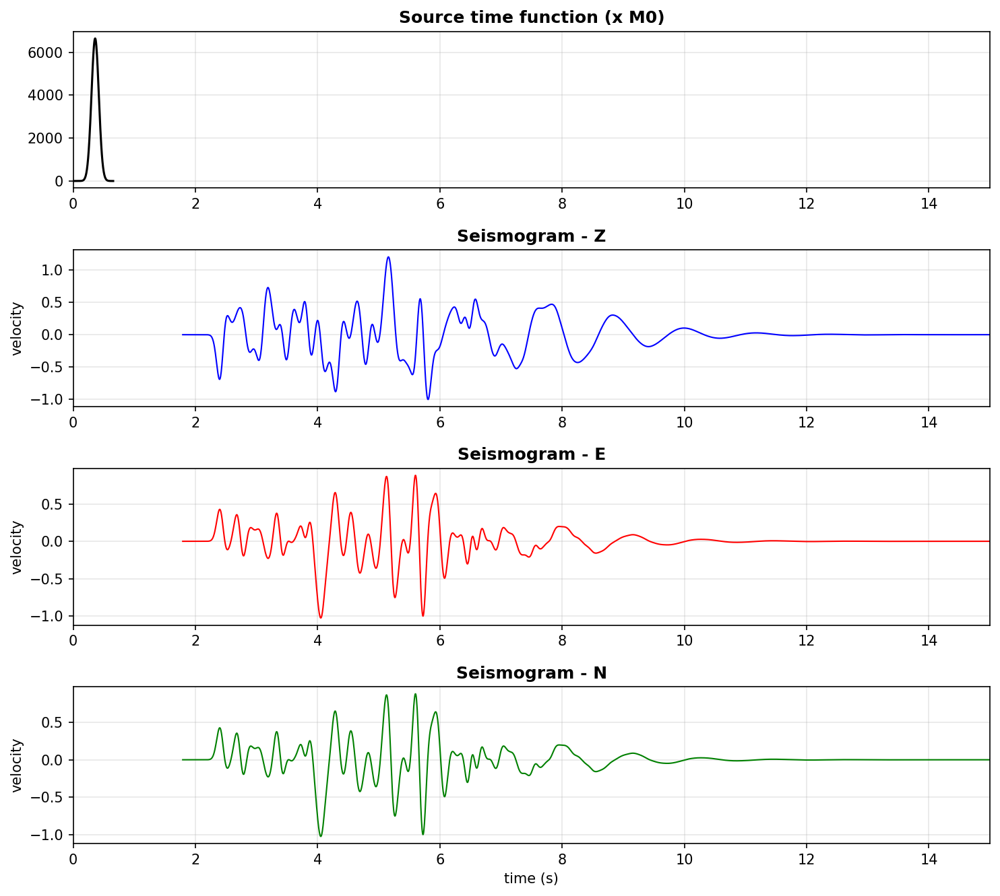

# Exercise 12: Validation — SCEC LOH.1

**Goal.** Reproduce the **SCEC LOH.1** benchmark and check ShakerMaker against
the published *Prose* reference solution — the test that establishes the FK
engine is correct. (Examples:
[`12_validation/`](../examples/index.md#12-validation).)

## The benchmark

LOH.1 is the canonical layered-half-space verification: a 1 km soft layer over
a half-space, a buried double-couple, a Gaussian source time function, and a
receiver 10 km away. It is exactly the model from [Exercise 1](01_first_run.md).

```python
from shakermaker import shakermaker
from shakermaker.cm_library.LOH import SCEC_LOH_1
from shakermaker.pointsource import PointSource
from shakermaker.faultsource import FaultSource
from shakermaker.station import Station
from shakermaker.stationlist import StationList
from shakermaker.stf_extensions.gaussian import Gaussian

crust = SCEC_LOH_1()

sigma = 0.06
stf   = Gaussian(t0=6 * sigma, freq=1 / sigma, M0=1e18 / 5e14 / 2)
src   = PointSource([0, 0, 2], [0., 90., 0.], stf=stf)
fault = FaultSource([src], metadata={"name": "LOH1_source"})

sta = Station([6.0, 8.0, 0.0], metadata={"name": "loh1", "save_gf": True})
model = shakermaker.ShakerMaker(crust, fault, StationList([sta], {}))

model.run(dt=0.025, nfft=4096, tb=1000, dk=0.1, tmax=4096 * 0.025)
```

`metadata={"save_gf": True}` keeps the per-subfault Green's functions so you
can inspect the kernels (below), not just the final trace.

## Result 1: it matches the reference

Overlaying ShakerMaker on the Prose reference, the radial, transverse and
vertical components agree to **correlation ≥ 0.996**:

{ width=620 }

## Result 2: the kernels behind it

Because we saved the Green's functions, we can see the **nine elementary
Green's functions** that recombine into the seismogram (one panel,
`Gf_13`, is identically zero by symmetry):

{ width=680 }

…the source time function and the three-component result it produces:

{ width=620 }

These are the same figures used in [The FK method](../background/fk_method.md)
— here they double as the validation record.

## A quick numeric check

`LOH1_check.py` runs the model and asserts the response is non-empty and
correctly shaped — a minimal regression guard you can drop into CI:

```bash
python examples/12_validation/LOH1_check.py     # prints PASS
```

## Checkpoint

You have reproduced a published benchmark and confirmed the FK engine is
correct end to end. That closes the exercise path — back to the
[exercise index](index.md) or on to the [API reference](../api/index.md).
