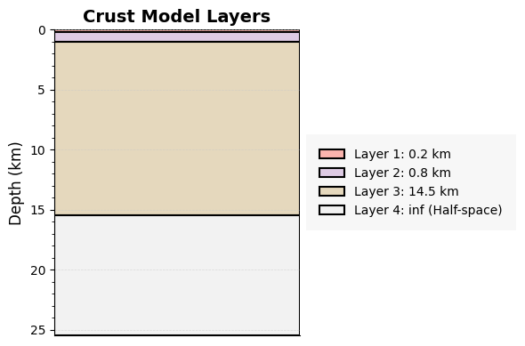
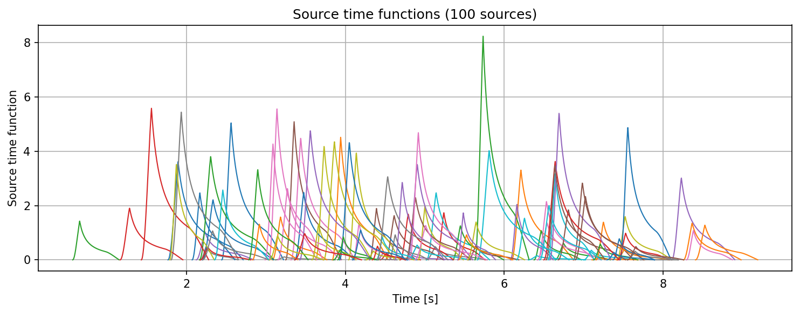
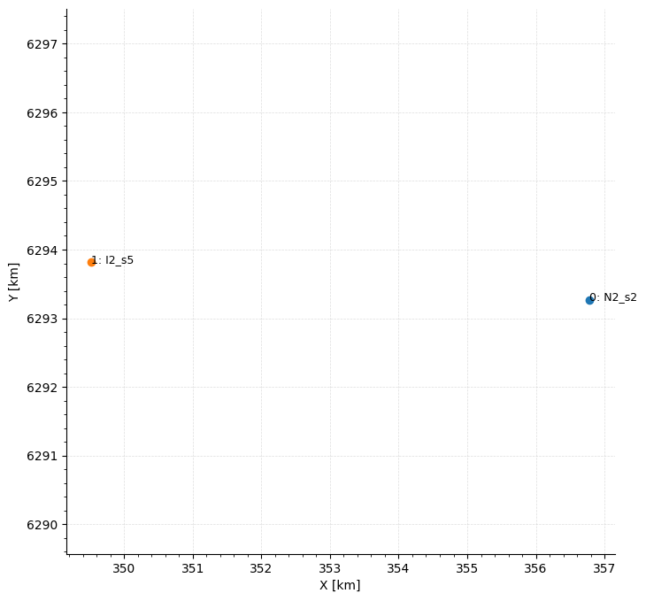
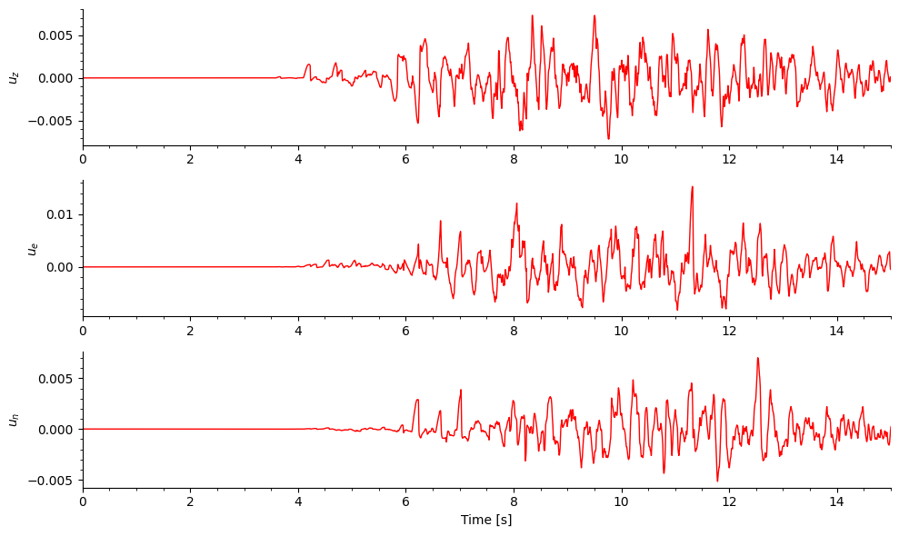
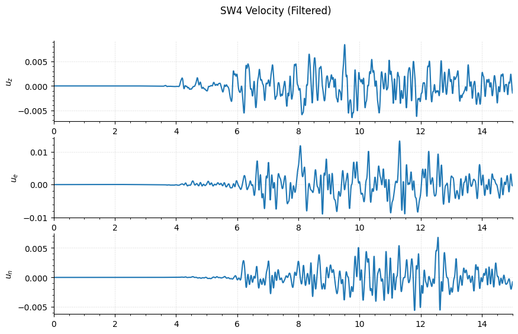
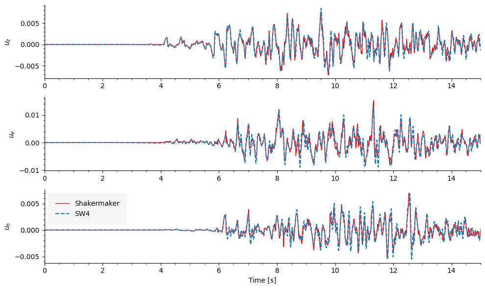

# Exercise 13: ShakerMaker vs SW4

**Goal.** Cross-validate the FK engine against a full 3-D **SW4**
finite-difference simulation on the *same* model — a 4-layer crust, **100 FFSP
point sources**, and two surface stations — and overlay the two solutions.
Agreement here is the strongest evidence the whole pipeline is physically
correct. (Example: [`13_shakermaker_sw4/`](../examples/index.md#13-shakermaker-vs-sw4).)

## The idea

Both solvers are driven from a **single ShakerMaker export**, so the source and
geometry are byte-for-byte identical. SW4 was already run (its output ships in
`data/`); here we rebuild the matching ShakerMaker model, run the FK engine, and
compare. Any residual difference is **method**, not setup: FK is semi-analytic
in a layered half-space, SW4 is finite-difference on a 3-D grid.

The whole model — crust, sources and stations — is read back from the compact
package `model_summary.h5` that `export_sw4` wrote (see
[Exercise 10](10_sw4_export.md)).

## Step 1 — Rebuild the model from the SW4 package

### The crust

```python
import h5py
from shakermaker.crustmodel import CrustModel

with h5py.File("data/model_summary.h5", "r") as f:
    g = f["crust"]
    thickness, vp, vs = g["thickness_km"][:], g["vp_km_s"][:], g["vs_km_s"][:]
    rho, qp, qs = g["rho_g_cm3"][:], g["qp"][:], g["qs"][:]

crust = CrustModel(len(thickness))
for i in range(len(thickness)):
    crust.add_layer(thickness[i], vp[i], vs[i], rho[i], qp[i], qs[i])
crust.plot()
```

{ width=380 }

### The 100 sources

Each FFSP subfault is stored as a **discrete slip-rate** time series; we wrap
each in a `Discrete` STF and a `PointSource`:

```python
import numpy as np
from shakermaker.pointsource import PointSource
from shakermaker.faultsource import FaultSource
from shakermaker.stf_extensions import Discrete

with h5py.File("data/model_summary.h5", "r") as f:
    s = f["sources"]
    x, y, z = s["x_km"][:], s["y_km"][:], s["z_km"][:]
    strike, dip, rake = s["strike_deg"][:], s["dip_deg"][:], s["rake_deg"][:]
    tt, dt_all, npts_all = s["trigger_time_s"][:], s["dt"][:], s["npts"][:]
    offsets, values = s["data_offsets"][:], s["data_values"][:]

sources = []
for i in range(len(x)):
    dt, npts, off = float(dt_all[i]), int(npts_all[i]), int(offsets[i])
    stf = Discrete(values[off:off + npts], np.arange(npts) * dt)
    stf.dt = dt
    sources.append(PointSource([x[i], y[i], z[i]],
                               [strike[i], dip[i], rake[i]], tt=tt[i], stf=stf))

fault = FaultSource(sources, metadata={"name": "from_sw4_package"})
```

The 100 slip-rate functions, each triggered at its own rupture time `tt` — the
spread in time is the rupture propagating across the fault:

{ width=420 }

### The stations

```python
import ast
from shakermaker.station import Station
from shakermaker.stationlist import StationList

with h5py.File("data/model_summary.h5", "r") as f:
    g = f["stations"]
    xyz, internal, meta_raw = g["xyz_km"][:], g["internal"][:], g["metadata"][:]

stations = StationList(
    [Station(xyz[i], internal=bool(internal[i]),
             metadata=ast.literal_eval(meta_raw[i].decode()))
     for i in range(len(xyz))],
    metadata={"name": "from_sw4_package"})
```

{ width=420 }

## Step 2 — Run the FK engine

```python
from shakermaker import shakermaker

model = shakermaker.ShakerMaker(crust, fault, stations)

# pre-flight report (dt + tmax centred) — read it before committing to the run
model.check_parameters(dt=0.0025, nfft=8192 * 4, dk=0.2, tb=800, tmax=60)

model.run(dt=0.0025, nfft=8192 * 4, dk=0.2, tb=800, tmax=60,
          tmin=0.0, sigma=2, pmax=1, nx=1, kc=15.0, verbose=True)
```

!!! warning "This is a heavy run"
    `nfft = 32768` × 100 sources is not a laptop-in-seconds job. Launch under
    MPI for real use: `mpiexec -n 8 python shaker_vs_sw4.py`. The FK
    Green's functions are shared across sources, so cost scales sub-linearly.

The ShakerMaker velocity at station 0:

{ width=620 }

## Step 3 — Read and filter the SW4 output

SW4 wrote one `.txt` per receiver (`time, x, y, z`). Map its columns to the
ShakerMaker convention ($u_z=z,\ u_e=y,\ u_n=x$) and band-pass with **ObsPy**
to the same band the FK run resolves (0.25–15 Hz):

```python
import numpy as np
from obspy import Trace

def read_sw4_station(path):
    a = np.loadtxt(path, skiprows=13)
    return a[:, 0], a[:, 3], a[:, 2], a[:, 1]      # t, u_z, u_e, u_n

def bandpass(sig, dt, fmin=0.25, fmax=15.0):
    tr = Trace(data=sig.astype(np.float32)); tr.stats.delta = dt
    tr.filter("bandpass", freqmin=fmin, freqmax=fmax, corners=4, zerophase=True)
    return tr.data

t_s, z_s, e_s, n_s = read_sw4_station("data/sf00001.txt")
dt_s = t_s[1] - t_s[0]
z_f, e_f, n_f = bandpass(z_s, dt_s), bandpass(e_s, dt_s), bandpass(n_s, dt_s)
```

The filtered SW4 velocity:

{ width=620 }

The zero-phase band-pass matters: it removes SW4's low-frequency grid drift and
trims content above the FK band, so the two are compared on equal footing.

## Step 4 — Overlay and compare

```python
import matplotlib.pyplot as plt

sta = stations.get_station_by_id(0)
z_sm, e_sm, n_sm, t_sm = sta.get_response()

fig, ax = plt.subplots(3, 1, figsize=(10, 6), sharex=True)
for k, (sm, sw, lab) in enumerate([(z_sm, z_f, r"$u_z$"),
                                   (e_sm, e_f, r"$u_e$"),
                                   (n_sm, n_f, r"$u_n$")]):
    ax[k].plot(t_sm, sm, "r", lw=1, label="ShakerMaker")
    ax[k].plot(t_s, sw, "--", label="SW4")
    ax[k].set_xlim(0, 15); ax[k].set_ylabel(lab); ax[k].grid(True)
ax[0].legend(loc="upper left"); ax[2].set_xlabel("Time [s]")
plt.tight_layout(); plt.show()
```

{ width=680 }

## What it tells you

The semi-analytic FK solution (red) and the 3-D finite-difference SW4 solution
(dashed) **track each other across all three components** — same arrival times,
same phases, same amplitudes — through the entire 100-source rupture. Two
independent numerical methods agreeing on the same physics is the cross-check
that validates an FK-to-SW4 (or FK-to-FE) coupling workflow end to end.

## Run it

```bash
pip install obspy
cd examples/13_shakermaker_sw4
python shaker_vs_sw4.py          # or: mpiexec -n 8 python shaker_vs_sw4.py
```

All inputs ship in `data/`; the script writes `compare_sf0000*.png`.

## Checkpoint

You can reconstruct a model from an SW4 package, run the FK engine, and
validate it against a full finite-difference simulation. Back to the
[exercise index](index.md).
