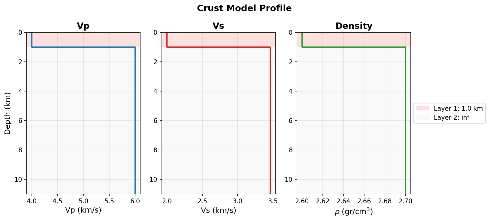

# Crust model

The medium: a 1-D layered, anelastic half-space. Build it layer by layer,
top to bottom. The last layer (zero thickness) is the half-space.

## Input: `add_layer`

```python
from shakermaker.crustmodel import CrustModel

crust = CrustModel(2)                                  # number of layers
crust.add_layer(1.0, 4.0, 2.0, 2.6, 10000., 10000.)   # soft surface layer
crust.add_layer(0.0, 6.0, 3.464, 2.7, 10000., 10000.) # half-space (d = 0)
```

`add_layer(d, vp, vs, rho, qp, qs)`, positional, in this exact order:

| Arg | Symbol | Units | Meaning |
|---|---|---|---|
| `d` | $d$ | km | layer thickness (**0 = half-space**) |
| `vp` | $V_P$ | km/s | P-wave velocity |
| `vs` | $V_S$ | km/s | S-wave velocity (must be `< vp`) |
| `rho` | $\rho$ | g/cm³ | density |
| `qp` | $Q_P$ | – | P quality factor (↑ = less damping) |
| `qs` | $Q_S$ | – | S quality factor |

`add_layer` validates the physics (positive speeds/density/Q, $V_P > V_S$).
Use a large `Q` (e.g. `10000`) for a near-elastic medium.

## Input: pre-packaged models (`shakermaker.cm_library`)

Skip the hand-building with a benchmark model:

```python
from shakermaker.cm_library.LOH import SCEC_LOH_1
crust = SCEC_LOH_1()        # 1 km soft layer over a half-space
```

| Constructor | Model |
|---|---|
| `SCEC_LOH_1()` | SCEC LOH.1 benchmark — soft layer over a half-space, near-elastic |
| `SCEC_LOH_3()` | SCEC LOH.3 benchmark — same geometry as LOH.1 but **with attenuation** |
| `AbellThesis(split=1)` | crust from J. A. Abell's PhD thesis / paper |
| `SOCal_LF()` | Southern California low-frequency crust (SCEC BBP) |

```python
from shakermaker.cm_library.LOH import SCEC_LOH_1, SCEC_LOH_3
from shakermaker.cm_library.AbellThesis import AbellThesis
from shakermaker.cm_library.SOCal_LF import SOCal_LF
```

!!! note "LOH.1 vs LOH.3"
    `SCEC_LOH_1()` approximates a purely elastic medium with very high
    quality factors (`Q = 10000`). `SCEC_LOH_3()` uses the same two-layer
    geometry (a 1 km slow layer over a half-space) but with realistic,
    finite quality factors ($Q_S \approx 55$ in the soft layer), so it
    exercises the anelastic attenuation path.

!!! tip "`AbellThesis(split=...)`"
    The `split` argument subdivides each tabulated layer into `split`
    equal-thickness sub-layers (default `split=1`, the layering as
    published). Increasing it refines the depth discretisation without
    changing the velocity/density profile — useful when you need more
    interfaces for sampling or for the OP pipeline's depth clustering.

`plot_profile()` draws the velocity and density structure versus depth:

{ width=460 }

## Result: inspect the model

```python
crust.plot_profile()        # velocity / density vs depth
```

Quick queries (no plotting): `crust.nlayers`, and the per-layer arrays
`crust.d`, `crust.a` (Vp), `crust.b` (Vs), `crust.rho`, `crust.qa`, `crust.qb`.

| Method | Returns |
|---|---|
| `properties_at_depths(z)` | $(V_P, V_S, \rho, Q)$ sampled at depth(s) `z` |
| `get_layer(z)` | index of the layer containing depth `z` |
| `split_at_depth(z)` | inserts an interface at depth `z` |
| `modify_layer(i, vp=…, …)` | edits layer `i` in place |
| `plot()` / `plot_profile()` | layer plot / full profile |


## CRUST 1.0: a global starting profile

If you don't have a velocity model handy, ShakerMaker bundles a reader for the
[**CRUST 1.0**](https://igppweb.ucsd.edu/~gabi/crust1.html) global crustal model
(Laske et al., 2013). The data ships inside the package, so it needs no path
configuration:

```python
from shakermaker.crust1 import Crust1   # prints CRUST1_CITATION on import

crust1 = Crust1()                          # zero-config: finds the grids next to crust1.py
crust1.print_shakermaker((-33.42, -70.61))  # ready-to-paste CrustModel snippet
```

`profile_at(lat, lon)` returns the local 9-layer column (water/ice/seds/crust/mantle)
and `print_shakermaker(...)` prints a `CrustModel` you can paste straight in. See
`examples/01_crustmodel/crust1_sites.py` and the [CRUST 1.0 API →](../api/crust1.md).

## Reference

[`CrustModel` API →](../api/crustmodel.md)
