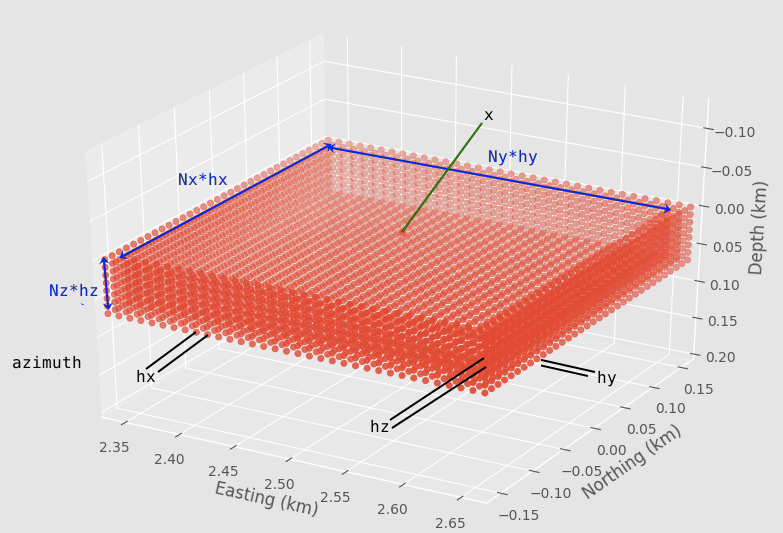
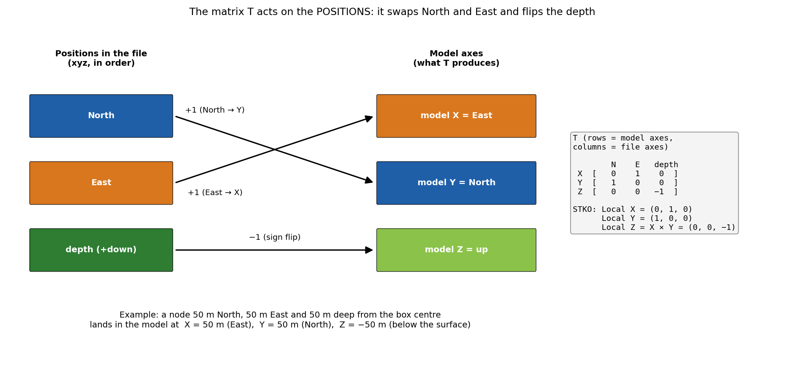
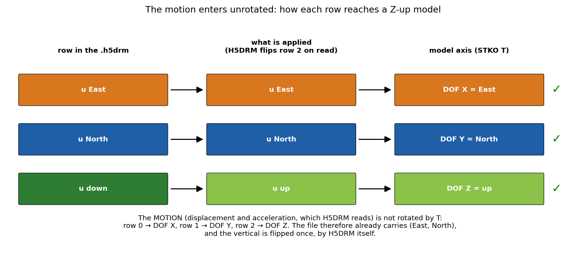
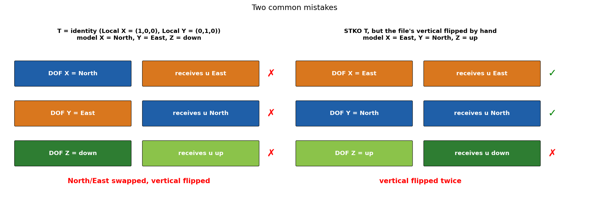

# Domain Reduction Method (DRM)

The DRM couples a regional FK simulation to a local detailed model. ShakerMaker
computes the boundary motions; a finite-element/-difference solver (OpenSees,
SW4) consumes them. For the full hands-on workflow see
[Exercise 5](../exercises/05_drm.md).

## Why DRM

Simulating an entire region at the resolution a building site needs is
intractable. The DRM (Bielak et al., 2003) splits the problem: the
**free-field** wavefield is computed cheaply over a regional 1-D model with
FK, captured on a **box** of receivers surrounding the site, and then injected
on that box as an equivalent boundary load that drives the local nonlinear
model, with the local model adding only the *scattered* field.

{ width=460 }

## The theory in brief: Bielak's two-step reduction

The DRM (Bielak et al., 2003) is a **two-step domain decomposition**. Split the
medium at a closed surface $\Gamma$ — the DRM box — into an **interior**
$\Omega$ (the small, possibly nonlinear, finite-element model of the site) and
an **exterior** $\Omega^+$ (the regional half-space containing the source). The
single layer of elements straddling $\Gamma$ couples the two.

**Step 1 — free field.** With the source active but the interior replaced by the
*same* background medium, solve the cheap **free-field** (background) problem
$u^0$ over the exterior. This is exactly the regional FK simulation: ShakerMaker
evaluates $u^0$ — displacement, velocity, acceleration — at every node on $\Gamma$
and its adjacent ring. Because the interior is identical to the background in
this step, the expensive local model plays no part; only the regional 1-D model
and the source matter.

**Step 2 — effective forces.** The total motion is decomposed as the free field
plus a **scattered field** $w$,

$$
u = u^0 + w \quad\text{outside } \Gamma, \qquad u = u^0 \text{ on the interior boundary,}
$$

where $w$ is the *only* part the local model must compute — the perturbation the
site (basin, topography, nonlinearity) adds to the incoming wave. Substituting
this split into the equation of motion shows that the free field can be removed
everywhere except on the single boundary layer, where it survives as a set of
**effective nodal forces** acting only on $\Gamma$:

$$
P^\text{eff}_b = -\,M_{be}\,\ddot u^0_e - K_{be}\,u^0_e, \qquad
P^\text{eff}_e = \ \ \ M_{eb}\,\ddot u^0_b + K_{eb}\,u^0_b,
$$

with $b$ the boundary-layer nodes and $e$ the exterior nodes just outside, and
$M$, $K$ the mass and stiffness of *only* the boundary-layer elements. The
interior degrees of freedom carry **no** effective load: the source enters the
local model purely through these boundary forces.

**Why this works.** A finite-element model large enough to contain both a
regional fault and a metre-scale site mesh is intractable. The DRM lets a
**small** local domain "see" a **regional** source by injecting the
free-field motion as boundary forces on a thin layer, and lets the interior add
only the scattered field, with non-reflecting / absorbing conditions on the
outer face soaking up $w$ as it radiates back out. The free field is computed
once, cheaply, with FK; the local model is solved once, at full resolution,
driven by the box.

## Defining the box: `DRMBox`

```python
from shakermaker.sl_extensions import DRMBox

fmax = 10.0
h    = 3.5 / fmax / 15
drm  = DRMBox([10., 10., 0.], [10, 10, 4], [h, h, h],
              metadata={"name": "site"}, azimuth=0.)
```

`DRMBox(pos, nelems, h, metadata={}, azimuth=0.)`:

| Arg | Meaning |
|---|---|
| `pos` | box **centre** `[x, y, z]` (km) |
| `nelems` | station counts `[Nx, Ny, Nz]` |
| `h` | spacings `[hx, hy, hz]` (km) |
| `azimuth` | box orientation (deg) |

Side lengths: interior `[Nx·hx, Ny·hy, Nz·hz]`; exterior boundary adds a ring,
`[(Nx+2)·hx, (Ny+2)·hy, (Nz+1)·hz]`. Choose `h ≈ Vs / fmax / 15` to resolve
the band, and `dt ≈ 1/(2·fmax)` for Nyquist.

## Running and writing H5DRM

```python
from shakermaker.slw_extensions import DRMHDF5StationListWriter

writer = DRMHDF5StationListWriter("motions.h5drm")
model  = ShakerMaker(crust, fault, drm)
model.run(dt=1/(2*fmax), nfft=2048, tb=500, dk=0.1, writer=writer)
```

The writer streams results to disk as they are computed (O(1) memory), so very
large boxes are feasible.

## The H5DRM file

```
/DRM_Data
    xyz            (n_nodes, 3)        node positions (North, East, depth), km
    internal       (n_nodes,)  bool    interior vs boundary node
    data_location  (n_nodes,)  int32   first row of each node = 3·index
    velocity       (3·n_nodes, nt)     rows (East, North, down) per node
    displacement   (3·n_nodes, nt)     same rows
    acceleration   (3·n_nodes, nt)     same rows
/DRM_QA_Data       xyz (1, 3) and the same three datasets for the QA station
/DRM_Metadata      dt, tstart, tend, drmbox_x0 (box top centre), box bounds, h, ...
```

Positions and motion follow different orders on purpose; see
[Coordinates & conventions](../background/conventions.md#positions-and-motion-are-different-things).
Inspect with `h5ls -r motions.h5drm` or `h5dump -H motions.h5drm`.

## Using the .h5drm in OpenSees

OpenSees' `H5DRMLoadPattern` reads the file directly and applies the DRM
boundary forces. It does two independent things with the file:

1. **It places the nodes** using the **positions**. For each node it subtracts
   the box top centre (`drmbox_x0`), multiplies by `crd_scale` (1000 for km →
   m), applies the 3 × 3 matrix `T`, and adds `x0` (where the box top centre
   sits in the model). The result is matched against the mesh nodes within
   `distance_tolerance` (in model units).
2. **It applies the motion** using the **displacement and acceleration** rows of
   each node, which it copies **without rotation**: row 0 goes to DOF 1, row 1
   to DOF 2, row 2 to DOF 3. On read it flips the sign of row 2, so the
   vertical becomes positive up. **`T` is never applied to the motion.**

This is why the file stores the positions in ShakerMaker's frame and the motion
already reordered: `T` turns the positions into the model frame, and the motion
arrives in that frame by construction.

### The matrix T for a Z-up model

For a model built with X = East, Y = North, Z = up, the matrix is

```
               North  East  depth     <- file axes (columns)
model X     [    0     1     0  ]     X = East
model Y     [    1     0     0  ]     Y = North
model Z     [    0     0    -1  ]     Z = -depth = up
```

Each row says which file axis feeds each model axis: it swaps North and East
and flips the depth. Its determinant is +1, a proper rotation. In STKO this is
**Local X = (0, 1, 0)** and **Local Y = (1, 0, 0)**; STKO computes Local Z as
Local X × Local Y = (0, 0, −1) and writes the full matrix.



*A node 50 m North, 50 m East, and 50 m deep from the box centre lands in the
model at X = 50 m, Y = 50 m, Z = −50 m.*

With that `T`, each degree of freedom receives the motion along its own axis:

| Model DOF | Model axis (from `T`) | Row received | Matches |
|---|---|---|---|
| 1 | X = East | row 0 = u East | yes |
| 2 | Y = North | row 1 = u North | yes |
| 3 | Z = up | row 2 = u down, flipped on read → u up | yes |



### Command syntax

Tcl (all 18 values; `T` is read only when the 12 trailing values are present):

```tcl
# pattern H5DRM tag file factor crd_scale distance_tolerance do_transform T00 T01 T02 T10 T11 T12 T20 T21 T22 x00 x01 x02
pattern H5DRM 1 "motions.h5drm" 1.0 1000.0 1.0e-3 1   0 1 0   1 0 0   0 0 -1   0.0 0.0 0.0
```

openseespy:

```python
T  = [0, 1, 0,
      1, 0, 0,
      0, 0, -1]          # rows of T: X = East, Y = North, Z = up
x0 = [0.0, 0.0, 0.0]     # model position of the box top centre
ops.pattern('H5DRM', 1, 'motions.h5drm', 1.0, 1000.0, 1.0e-3, 1, *T, *x0)
```

Pass the full argument list: the optional arguments are read only when more
arguments follow them, so a call that stops at `do_transform` leaves the
transformation (and `crd_scale`) off.

### Common mistakes



- **`T` = identity** (Local X = (1,0,0), Local Y = (0,1,0)): the model keeps
  ShakerMaker's axes, so X (North) receives East and Y (East) receives North,
  and the vertical, flipped on read, lands upside down on a Z-down axis.
- **Flipping the vertical in the file by hand**: the load pattern already flips
  it, so it ends up flipped twice.

### Checking a new model

Record (`recorder Node`) the displacement of an interior node close to the QA
station and compare it with the QA rows of the file. With the matrix above,
$u_X$ correlates positively with row 0 (East), $u_Y$ with row 1 (North), and
$u_Z$ **negatively** with row 2, because the model's Z points up and the file's
row 2 points down. Use a case where North and East differ clearly at the QA
(avoid a symmetric source with the QA on the NE diagonal), or a swap of the
horizontals goes unnoticed.

## Consuming the motions

- **OpenSees**, the `H5DRMLoadPattern` reads the file directly and applies
  the DRM boundary forces (see [Using the .h5drm in OpenSees](#using-the-h5drm-in-opensees)).
  This is the de-facto FK→FE coupling standard.
- **From an SW4 case**, `examples/09_sw4_export/build_h5drm_from_sw4_case.py`
  builds an `.h5drm` from an SW4 run, with SW4-local-km ↔ ShakerMaker/UTM-km
  conversion.
- **Geometry only**, `model.export_drm_geometry("drm_geometry.h5drm")` writes
  the box geometry without running the simulation.

## Validation

`examples/08_drm/drm_vs_direct.py` toggles `do_DRM` to confirm that the
DRM-injected motion matches a direct FK computation at the same point, within
the tolerance set by `sigma` and `dk`.

## Reference

[Receivers → DRMBox](receivers.md) · [ShakerMaker engine API](../api/shakermaker.md)
