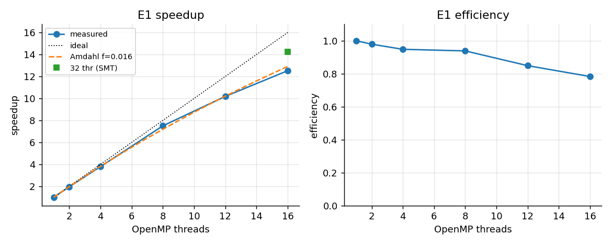
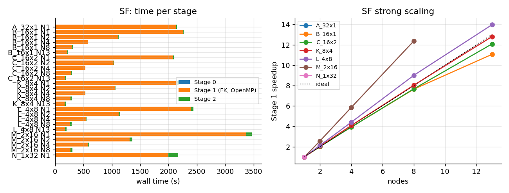
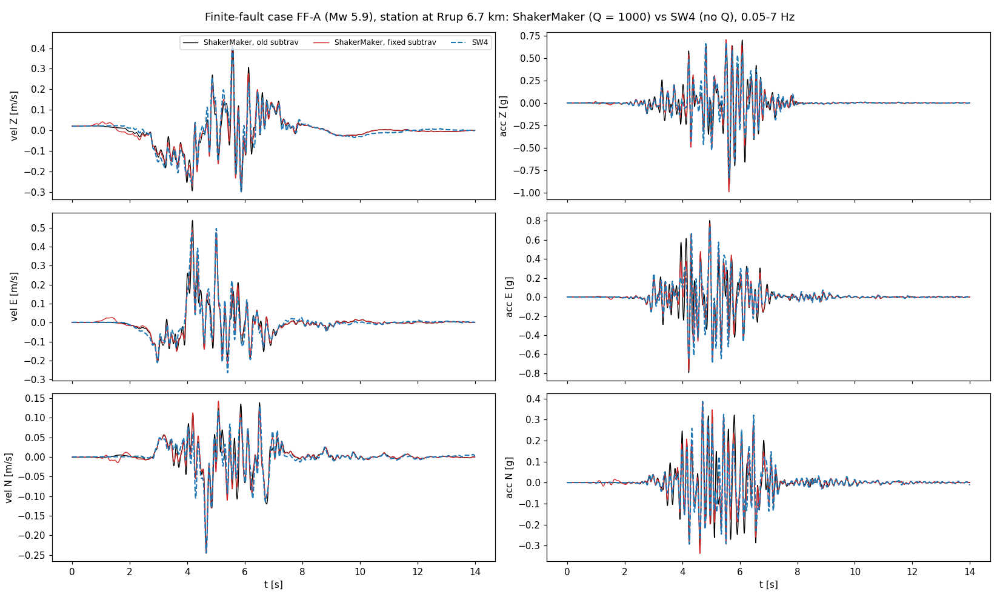

# Performance on a cluster: MPI, OpenMP and the two stages

This page records the scaling and optimisation work done on ShakerMaker in
October 2026: what was changed, what was measured, and what was not adopted.
Every number comes from runs on one cluster, so treat it as a reference for
similar hardware, not as a guarantee.

**Hardware.** A cluster of AMD Ryzen 9 5950X nodes (16 cores / 32 hardware
threads, ~64 GB), 2.5 GbE between nodes, shared NFS.
Exclusive nodes in every run. One run per configuration unless stated, so
differences below ~3 % are not conclusive.

## 1. Where the time goes

`run_nearest` / the OP pipeline runs in three stages:

| Stage | Work | Parallelism |
|---|---|---|
| 0 `gen_pairs` | source-receiver pairs and unique GF slots | rank 0 alone, seconds to minutes |
| 1 `compute_gf` | one FK Green's function per unique slot (`subgreen` + `subfk`) | MPI over slots, OpenMP inside the FK kernel |
| 2 `run_fast` | per source: `subgreen2`, STF convolution, shift and sum | MPI only |

Stage 1 dominates (90-99 % of the wall time in every case below).

### Stage 0: grouping on one process

Stage 0 visits the pairs in order and puts each one in the existing slot
that covers it (every difference within its tolerance) with the smallest L1
distance, or opens a new slot. Each decision depends on the slots opened
before it, so the grouping is sequential. The previous implementation
compared every pair with every slot (cost pairs x slots) after gathering the
geometry of all pairs on rank 0 (32 bytes per pair, ~200 bytes per pair on
the node), while the other ranks waited.

Now rank 0 builds the map alone. A slot that covers a pair can only lie in
one of the 27 cells around it when the cells are slightly larger than the
tolerances, so a hash table over those cells gives the candidates, tested
with the same coverage rule, distance and tie rule (lowest slot index). The
geometry is computed one block of stations at a time with the same NumPy
expressions, and the representative of a slot is the pair that opened it,
so the final sorts are gone. The map is the same, dataset by dataset.
`SM_S0_LEGACY=1` runs the previous path.

DRM boxes of 8179 receivers with a 32768-subfault fault (2.7e8 pairs,
tolerances 40 / 5 / 200 m):

| | previous (10 nodes x 16 ranks) | now (one process) |
|---|---|---|
| 14 460 slots | 1 888 s | 173 s |
| 20 688 slots | 2 666 s | 190 s |
| 25 686 slots | 3 280 s (grouping 3 215 s, gather 31 s, sorts 31 s) | 195 s (grouping 183 s) |
| memory | ~99 bytes per pair on rank 0 | 1.7 GB in total (~6 bytes per pair) |

The previous grouping cost 0.125 s per slot at this size; the new one does
not depend on the number of slots (57 380 slots: 259 s). Eleven such boxes
ran at once on one node in 4.5 min (1.7 GB each). The three maps with a
previous reference are identical to it. Stage 0 therefore needs one process:
inside a many-node `stage='all'` job the other nodes now wait minutes instead
of up to an hour, and a separate `stage=0` job on one node is enough.

## 2. OpenMP in the FK kernel (PR #19)

`subfk.f` parallelises the wavenumber loop and the inverse-FFT loop with
OpenMP. The question raised in the review was: one node, 32 MPI ranks without
OpenMP against 16 ranks with OpenMP, comparing results and performance.

**Results are unchanged.** Traces are bit-identical with 1 to 32 threads;
the `_gf.h5` and `.h5drm` files are identical (sha256) across 8 layouts and
1, 2 and 4 nodes; against SCEC LOH.1 the correlation stays >= 0.999 on the
three components.

**One Green's function** (LOH.1, `nfft` 4096):

| Threads | 1 | 2 | 4 | 8 | 16 | 32 (SMT) |
|---|---|---|---|---|---|---|
| Time (s) | 4.81 | 2.46 | 1.27 | 0.64 | 0.38 | 0.34 |
| Speedup | 1.0 | 1.96 | 3.79 | 7.51 | 12.5 | 14.2 |

{ width=520 }

**The requested comparison** (one node, DRM box of 7635 nodes, 1331 GFs):

| Layout per node | Stage 1 (s) | Node CPU |
|---|---|---|
| 32 ranks x 1 thread | 630 | 99 % |
| 16 ranks x 2 threads | 628 | 93 % |
| 16 ranks, OpenMP threads not set | 604 | 98 % |
| 16 ranks x 1 thread | 688 | 50 % |

32 x 1 and 16 x 2 tie. Both beat 16 x 1 by ~10 % because they also use the
SMT threads. Layouts with few ranks per node lose because, before the change
in section 3, rank 0 only received and wrote.

**Across nodes** (strike-slip fault model, 1810 GFs of ~12 s each, up to 13
nodes):

| Layout per node | 1 node | 2 | 4 | 8 | 13 |
|---|---|---|---|---|---|
| 16 x 1 | 2249 s | 1112 | 572 | 294 | 203 |
| 16 x 2 | 2077 | **1030** | 529 | 271 | 172 |
| 8 x 4 | 2152 | 1050 | **528** | 268 | **168** |



16 x 2 scales 12.1x on 13 nodes (93 %). The hybrid layouts win 7-10 % over
pure MPI on 1-8 nodes and 15-17 % on 13 nodes, where each rank gets only a
few GFs and longer single-thread GFs leave the last rank running alone.

**Recommended launch:** 16 x 2 per node up to 2 nodes, 8 x 4 from 4 nodes.

```bash
export OMP_NUM_THREADS=2 OMP_PLACES=threads OMP_PROC_BIND=close
mpirun -np $((16*NNODES)) --map-by ppr:16:node:PE=2 --bind-to hwthread \
       --use-hwthread-cpus python script.py

# from 4 nodes
export OMP_NUM_THREADS=4 OMP_PLACES=threads OMP_PROC_BIND=close
mpirun -np $((8*NNODES)) --map-by ppr:8:node:PE=4 --bind-to hwthread \
       --use-hwthread-cpus python script.py
```

## 3. Stage 1: dynamic scheduling

With the round-robin split, at 10 nodes workers spent up to 454 s blocked
sending to rank 0 and the slowest rank did 1.5x the work of the fastest.
`compute_gf` now uses a master-worker scheme when running under MPI:

- rank 0 hands the next slot to whichever worker finishes first, two slots
  in flight per worker;
- workers compress each slot (zlib level 4, the HDF5 gzip deflate) and send
  it with blocking sends; rank 0 stores it with `write_direct_chunk`;
- rank 0 also computes: a receiver thread handles MPI and the HDF5 writes.
  This needs the `threadsafe` wrappers in `core.pyf` (rebuild the core) and
  MPI initialised with `MPI_THREAD_MULTIPLE` (the mpi4py default);
- slots go out longest first, using the measured cost of a previous run
  when available.

The database layout is unchanged and the results are bit-identical to the
round-robin loop with the same core.

| Variable | Default | Effect |
|---|---|---|
| `SM_GF_STATIC=1` | off | use the original round-robin loop |
| `SM_GF_RANK0_COMPUTE=0` | on | rank 0 only receives and writes |
| `SM_GF_COSTFILE=<path>` | unset | order slots by a previous `<gf_file>.slotcost.npy` (written by every run) instead of the geometric proxy |

| Model (GFs), 10 nodes, 8 x 4 | Round-robin | Dynamic | Dynamic + compiler flags |
|---|---|---|---|
| Strike-slip, medium (1810) | 286 s | 207 s (-27 %) | - |
| Strike-slip, large (9100) | 1327 s | 922 s (-30 %) | 810 s (-39 %) |

Blocking time fell from 83-454 s to 0.4 s and the load imbalance from 1.5 to
1.01. On one node the gain comes from rank 0 computing (-6 to -10 %).

**Finite-fault case FF-A** (10 nodes). Reverse fault (strike 195, dip 40,
rake 90), plane 7.0 x 11.7 km from 3.0 to 10.4 km depth, Mw 5.9, 4096 FFSP
subfaults (mean slip 0.47 m, max 1.8 m), SRF2 slip-rate functions. Three
surface stations at Rrup 6.7, 11.4 and 16.1 km (Rjb 0.03-14.6 km). Crust:
five layers down to 57.7 km over a half-space (Vs 2.36-4.74 km/s, Qs
118-237). FK: `dt` 0.0025, `nfft` 16384, `dk` 0.083, `tb` 800, `tmax` 28.8;
5015 Green's functions. The truncated crust keeps the first three layers
and makes the fourth (Vs 3.92 km/s) a half-space below 32.8 km.

| Crust | Production launch (32 ranks, OpenMP not set) | Dynamic + flags, 8 x 4 |
|---|---|---|
| full | 20 400 s | 17 256 s (-15 %) |
| truncated at 32.79 km | 10 089 s | 8 147 s (-19 %) |
| truncated, Q = 1000 | 10 099 s | 8 119 s (-20 %) |

The gain is smaller than on the synthetic models: this FK kernel looks
memory-bandwidth bound (throughput per node barely changes with the rank x
thread split).

### Several slots per core call

For each frequency and wavenumber the FK core evaluates a kernel (the
response of the layer stack) that does not depend on the horizontal distance;
the distance only enters through the Bessel terms. `subfk` already loops over
several distances inside one kernel evaluation, so `compute_gf` groups the
slots that share the source and receiver depths into one core call.

The wavenumber step is `dk*pi/max(hs, x)`, where `hs` is the total finite
thickness of the crust split at the source and receiver depths (as the core
computes it, in float32). Distances up to `hs` share the step, so one call
with all of them returns, for each slot, exactly what a call per slot
returns; slots beyond `hs` keep a call of their own. Each extra distance
costs 3-6 % of a call. The batching is on by default and bit-identical.

| Case (Stage 1, same launch as the reference) | Slots | Core calls | One call per slot | Batched | Results |
|---|---|---|---|---|---|
| 4096 sources, 3 stations, crust with 57.7 km of finite layers, `nfft` 16384; 10 nodes x 8 x 4 | 5015 | 102 | 18 150 s | **1 900 s (9.6x)** | bit-identical database and motions |
| 32 768 sources, 1 station, crust with 15.5 km of finite layers, station farther than `hs` from the fault; 2 nodes x 16 x 2 | 2703 | 2703 | 19 948 s | 19 669 s | bit-identical (nothing to group) |

The gain depends on how many slots fall within `hs`: deep crust models and
stations near the source benefit most.

| Variable | Default | Effect |
|---|---|---|
| `SM_GF_BATCH=0` | on | one core call per slot (previous behaviour) |
| `SM_GF_BATCH_MB` | 512 | memory per call; a distance needs about `9*2*nfft*12` bytes (`tdata` plus the wavenumber sums) |
| `SM_GF_BATCH_MAX` | 64 | upper limit of distances per call |

The wavenumber sums in `subfk` live on the heap (an automatic array of
`nx*9*2*nfft` complex values would overflow the default stack); the core
must be rebuilt.

### Compact Green's function database

The core returns `tdata` in float32 and, with `smth = 1`, only the first
`smth*nfft` of its `2*nfft` samples are non-zero. `SM_GF_F32=1` stores
`/tdata` as float32 with only those samples (the attribute `nt_full` keeps
`2*nfft`); Stage 2 reads both layouts and zero-pads the compact one, so the
core receives exactly the same values. Off by default, because tools that
read `/tdata` directly expect the original layout. It applies to the MPI
(dynamic) Stage 1 path.

## 4. Compiler flags

Fortran core rebuilt with different flags, everything else equal:

| Flags | Time per GF | Results |
|---|---|---|
| `-O3` (default) | reference | reference |
| `-O3 -march=znver3 -ffp-contract=off` | -7 to -12 % | **bit-identical** |
| `-O3 -march=znver3` (FMA contraction) | faster | rejected: `t0` moves 1 ulp, 10 % of `.h5drm` traces off by > 10 % |
| `-Ofast` | faster | rejected, same reason |

`-ffp-contract=off` is what keeps the results identical. The flags are not
the default because `-march` is machine specific; use `-march=native` with
`-ffp-contract=off` when building for one cluster.

## 5. Stage 2

`run_fast` gave each station to one rank, so with 3 stations only 3 ranks
worked. Two changes:

- **sources split over all ranks** when there are fewer stations than ranks:
  each rank sums its share on the output grid with the same integer shift as
  `Station.add_to_response`, and an MPI Reduce adds the parts on rank 0. With
  more stations than ranks (a DRM box) the one-rank-per-station loop is kept,
  since it already uses every rank and the split would add one Reduce per
  station (2067-node DRM box: 4.7 s with one rank per station, 12.9 s split).
  `SM_S2_SPLIT=1` forces the split, `SM_S2_SPLIT=0` disables it;
- **split crust models cached** per (source depth, receiver depth).
- **STF convolution** (`SM_S2_CONV=fast`, off by default): each source time
  function is resampled once per (source, pair time step) instead of once
  per component and pair, the three components are convolved in one FFT,
  and only up to the last sample that `add_to_response` keeps (the
  convolution is causal, so those samples do not change). The pair time
  step is `t[1] - t[0]` of the pair's own grid, which differs from the
  nominal `dt` in the last bits and can change the resampled STF by one
  sample, so the cache is keyed on its exact value.
- **compact database** (`SM_GF_F32=1`, see section 3): less to read and
  decompress, and no float64 to float32 conversion per pair.

Stage 2 of the 4096-source, 3-station case on one node (16 x 2), same database:

| Variant | Stage 2 | Read | `subgreen2` | Convolution | Motions |
|---|---|---|---|---|---|
| reference | 6.92 s | 2.41 s | 1.50 s | 2.61 s | - |
| compact database, gzip | 3.95 s | 0.92 s | 0.41 s | 2.29 s | bit-identical |
| compact database, uncompressed | **3.85 s** | 0.53 s | 0.46 s | 2.50 s | bit-identical |
| `SM_S2_CONV=fast` | 6.95 s | - | - | **1.43 s** (from 2.67) | 1e-7 of the peak |

The convolution gain grows with the ratio between the trace length
(`2*nfft`) and the output window: 3.1-3.5x on a small DRM box with
`nfft` 8192 and a 10 s window.

| Case | Before | Sources split | Difference |
|---|---|---|---|
| FF-A (4096 sources, 3 stations), 1 node | 42.0 s | 5.5 s (16 ranks) | 4e-14 |
| FF-B (32 768 sources, 3 stations), 1 node | 633 s | 251 s (32 ranks) | 2e-13 |

FF-B: same mechanism and crust as FF-A, plane 60 x 23.3 km from 3.0 to 17.9
km depth, Mw 7.1, 32 768 subfaults, three stations above the rupture (Rrup
4.0-6.7 km, Rjb < 0.1 km), `nfft` 32768, `dk` 0.044, `tmax` 54.2, 28 932
Green's functions.

The crust cache alone is bit-identical and saves ~10 %.

## 6. What was tried and not adopted

- **FK kernel on a GPU** (RTX 5090, PyTorch prototype): FP64 throughput on
  that card is too low; the best case was 3.4x in FP64 and the full port was
  not justified.
- **Stage 2 summed in the frequency domain** (CPU): correct (1e-7) but not
  faster than splitting the sources.
- **Stage 2 on the GPU:** 10x faster than the old loop and ~4x faster than
  splitting the sources on a 32 768-source, 3-station case, but the
  acceleration differs by up to
  1e-3 of the PGA away from the peak, with broadband content. The CPU
  reference is accurate to 1e-7, so this is not round-off: the prototype
  resamples each STF with the nominal `dt`, while `convolve` uses each pair's
  own time step. Doing the same on the CPU reproduces the error (1e-3 of the
  PGA in acceleration, centroid 45-50 Hz, maximum away from the PGA; below
  1e-4 in response spectra). Not adopted yet; its natural use is many FFSP
  realisations on one GF database, which can stay in GPU memory.
- **Coarser time step with the same unfiltered band** (Stage 1): the FK cost
  scales with the square of the Nyquist frequency, and below the start of
  the taper the spectrum does not depend on `dt`. On the 4096-source,
  3-station case, `dt` 0.005 s with
  taper 0.8 and `dt` 0.01 s with taper 0.6 (same 20 Hz unfiltered band) made
  Stage 1 4.1x and 16.4x faster, but response spectra changed by 3-14 %
  below 0.5 s: the source time functions are also discretised with the run
  `dt`. It would need separate time steps for the Green's functions and the
  sources.
- **Grouping slots beyond `hs` by distance band** (Stage 1): each group uses
  the wavenumber step of its largest distance. 7.7x on the 32 768-source,
  1-station case, but results
  change by a few per cent where `dk` is not converged; it can only be judged
  against a reference with a finer `dk`.

## 7. Correctness: the `subtrav` fix checked against SW4

`subtrav` returns the first-arrival time `t0`. It took 1-based layer indices
where its ray loop needs 0-based ones, so the ray crossed the wrong layers
whenever source and receiver were not in adjacent layers. With OP, Stage 2
places the GF of a slot at the `t0` of each real pair, so a wrong `t0` puts
each subfault at the wrong time. On FF-A the fix changes `t0` in
99 % of the slots (median 0.16 s, max 1.05 s).

Check: FF-A with the crust truncated at 32.8 km, run
with the old and the fixed core (Q = 1000 in every layer) and with SW4 on
the same crust, source and stations (7 Hz, h = 33.3 m, no attenuation),
compared up to 14 s, 0.05-7 Hz:

| Station at Rrup 6.7 km (E / N / Z) | Old `subtrav` | Fixed `subtrav` |
|---|---|---|
| correlation with SW4 | 0.919 / 0.898 / 0.955 | **0.973 / 0.944 / 0.962** |
| normalised misfit | 0.40 / 0.45 / 0.30 | **0.23 / 0.33 / 0.27** |
| PGV / PGV SW4 | 1.08 / 0.93 / 0.95 | **0.98 / 1.01 / 1.02** |



The station closest to the fault is where the two cores differ;
the old core adds acceleration pulses that SW4 does not have. At the two
farther stations both cores tie (correlation 0.85-0.95). Runs made before
the fix can differ by up to about +-25 % in PGA and short-period PSA at
stations near the fault; long periods barely change.

With the case's own Q (Qs 118-196) ShakerMaker came out at 0.5-0.9 of SW4,
decreasing with distance; with Q = 1000 it is at 0.85-1.05. Compare against
an elastic SW4 run with Q = 1000 in ShakerMaker.

## 8. Open items

- With the fixed core, the station at Rrup 6.7 km shows a small pulse at
  1.0-1.7 s (5-10 % of the PGV) that neither SW4 nor the old core has. It is
  energy ahead of the first arrival inside the `tb` padding of the Green's
  functions of many subfaults (an FK precursor), not a misplaced slot; with
  the old core the window started about 1 s later and hid it. It does not
  move the peaks; which FK parameter controls it is still to be measured.
- `check_parameters` recommends `dk` 0.4 whatever the input, and that value
  drops the vertical correlation with LOH.1 to 0.89 (0.2: 0.9975; 0.1:
  0.9998; 0.05: 0.9999).
- Stage 2 on the GPU: its integer sample shift is the same as on the CPU.
  The difference against the CPU is broadband noise around 60 Hz that grows
  when differentiating to acceleration (<= 1e-5 at the PGA itself); it has
  to be judged after low-pass filtering to the model's band.
