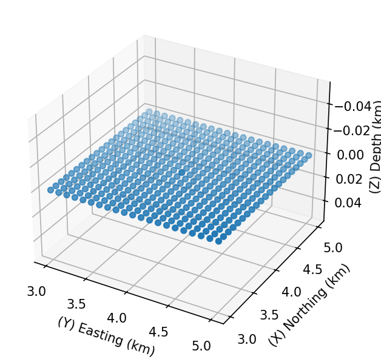
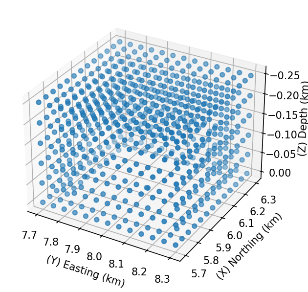
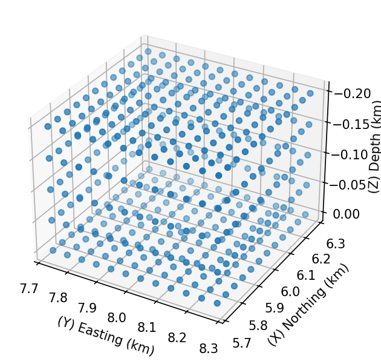
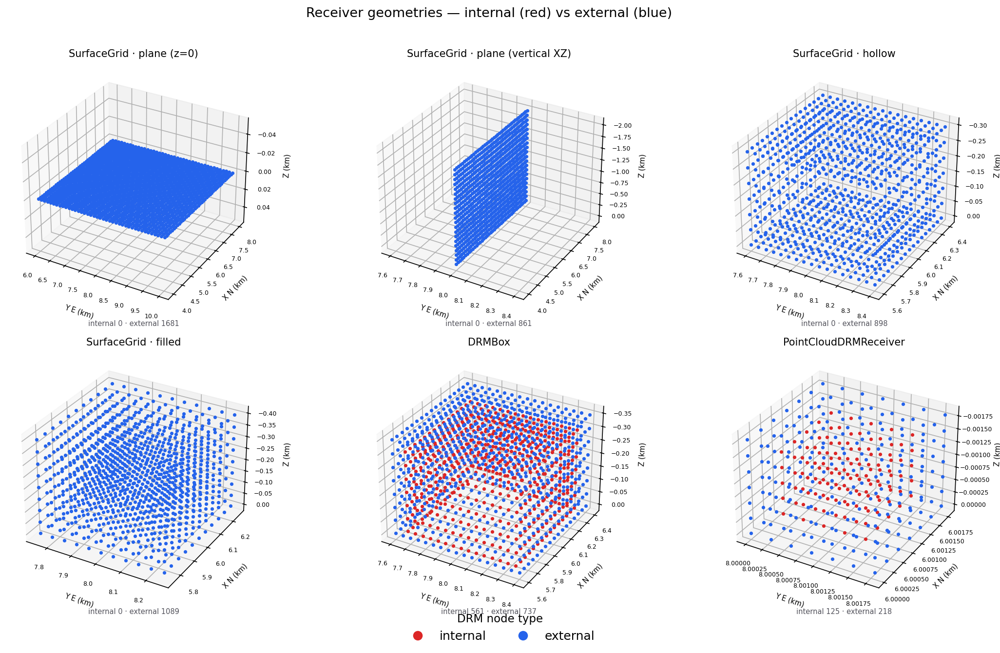

# Receivers

Where the motion is recorded. One `Station`, a `StationList`, or a geometric
array (grid, DRM box, point cloud).

## Input: `Station`

```python
from shakermaker.station import Station

s = Station([0, 4, 0], metadata={"name": "STA01"})   # location [x, y, z] km
```

`Station(x=None, internal=False, metadata={})`, `x` is `[x, y, z]` in km
(`z = 0` on the free surface). `metadata` accepts useful flags:

| Metadata key | Effect |
|---|---|
| `name` | label used in plots / output |
| `filter_results` + `filter_parameters` | apply a band filter (e.g. `{"fmax": 10.}`) |
| `save_gf` | keep the per-subfault Green's functions |

## Input: `StationList`

```python
from shakermaker.stationlist import StationList
stations = StationList([s], metadata=s.metadata)
```

## Input: receiver geometries (`sl_extensions`)

Real signatures (note `DRMBox` takes **box centre + element counts +
spacings**, not corner+shape):

```python
from shakermaker.sl_extensions import DRMBox

drm = DRMBox([10, 10, 0], [10, 10, 4], [0.05, 0.05, 0.05],
             metadata={"name": "site"}, azimuth=0.)
```

| Class | Signature | Inputs |
|---|---|---|
| `DRMBox` | `DRMBox(pos, nelems, h, metadata={}, azimuth=0.)` | `pos` = box centre `[x,y,z]` (km); `nelems` = `[Nx,Ny,Nz]`; `h` = spacings `[hx,hy,hz]` (km); `azimuth` (deg) |
| `SurfaceGrid` | `SurfaceGrid(x0, nelems, h, mode='plane', plane_x=, plane_y=, plane_z=, …)` | centre, counts, spacing, **mode** |
| `PointCloudDRMReceiver` | `PointCloudDRMReceiver(point_cloud_file, crd_scale, x0_fem, drmbox_x0)` | arbitrary points from a file |

> **DRM box sizing.** The interior side lengths are `[Nx·hx, Ny·hy, Nz·hz]`;
> the exterior boundary adds one element ring: `[(Nx+2)·hx, (Ny+2)·hy,
> (Nz+1)·hz]`. Pick `h ≈ Vs / fmax / 15` so the box resolves the band.

{ width=460 }

### `SurfaceGrid` modes

`SurfaceGrid` is the most flexible receiver factory: the same `(centre,
nelems, h)` arguments produce very different layouts depending on `mode`, 
from a flat plane to a hollow DRM shell to a full 3-D block. This is the
single class behind most station arrays.

| `mode` | Produces | Typical use |
|---|---|---|
| `'plane'` | a 2-D sheet of stations | a free-surface map or a cross-section |
| `'hollow'` | only the **faces** of a box (the shell) | a DRM boundary, cheaply |
| `'filled'` | every node inside a 3-D box | a volumetric sampling |

For a plane, fix the constant coordinate with `plane_x`, `plane_y`, or
`plane_z`, that is the axis the sheet is perpendicular to:

```python
from shakermaker.sl_extensions.SurfaceGrid import SurfaceGrid

centre = [6.0, 8.0, 0.0]
n = [100, 100, 1]
h = [0.1, 0.1, 0.1]            # km

# XY map on the free surface (z = 0)
grid = SurfaceGrid(centre, n, h, mode='plane', plane_z=0.0,
                   metadata={"name": "surface_map"})

# XZ cross-section at y = 8 km
grid = SurfaceGrid(centre, [20, 20, 10], h, mode='plane', plane_y=8.0,
                   metadata={"name": "xz_section"})

# Hollow DRM-style shell
grid = SurfaceGrid(centre, [22, 22, 7], [0.005]*3, mode='hollow',
                   metadata={"name": "drm_shell"})
```

A handy way to count nodes for a target physical size: `nx = int(Lx / dx)`,
where `Lx` is the side length in km and `dx` the spacing.

The three layouts, drawn with `StationPlot`:

| Surface grid (`plane`) | DRM box | Hollow shell |
|---|---|---|
|  |  |  |

*Reproduce with [`gen_station_geometry.py`](../examples/index.md#generating-the-figures).*

### The point clouds, side by side

Every receiver geometry is, in the end, a cloud of stations. For the DRM-style
geometries each station also carries an **`internal`** flag — interior nodes
the FEM solver drives directly (**red**) versus the outer boundary ring that
feeds the DRM load (**blue**). The plain `SurfaceGrid` layouts are pure
recording arrays, so every node is external (blue).

{ width=820 }

- **`SurfaceGrid · plane / hollow / filled`** — a sheet, a boundary shell, or a
  filled volume; all external. The sheet can be horizontal (`plane_z=0`, a
  free-surface map) **or** vertical (`plane_y`/`plane_x`, a depth
  cross-section) — both shown.
- **`DRMBox`** — two nested shells: the inner (red) and outer (blue) DRM
  boundaries.
- **`PointCloudDRMReceiver`** — arbitrary FEM nodes whose `Type` column
  (`internal` / `external`) sets the colour; here a red core inside a blue cage.

These are drawn denser than the runnable
[`examples/04_receivers/`](../examples/index.md#04-receivers) scripts on purpose
— just so the clouds read clearly.

*Reproduce with [`gen_receiver_clouds.py`](../examples/index.md#generating-the-figures).*

### Coordinate convention

ShakerMaker uses **`x` = North, `y` = East, `z` = down (depth)**, all in km,
with the free surface at `z = 0`. Keep this in mind when you place a grid or a
box relative to a source.

## Result: read a station

```python
z, e, n, t = s.get_response()     # three components + time vector
s.save("STA01.npz")               # persist
s.load("STA01.npz")               # restore
```

Array helpers: `StationList.nstations`, `get_station_by_id(i)`,
`add_station(...)`, `finalize()`.

## Station-array patterns

The `examples/04_receivers/` scripts show ready-made layouts:
`drmbox.py` (DRM box), `surface_grid.py` (plane / hollow / filled surface
grids), and `pointcloud_drm.py` (an arbitrary FEM node cloud).

## Reference

[Receivers API →](../api/receivers.md)
