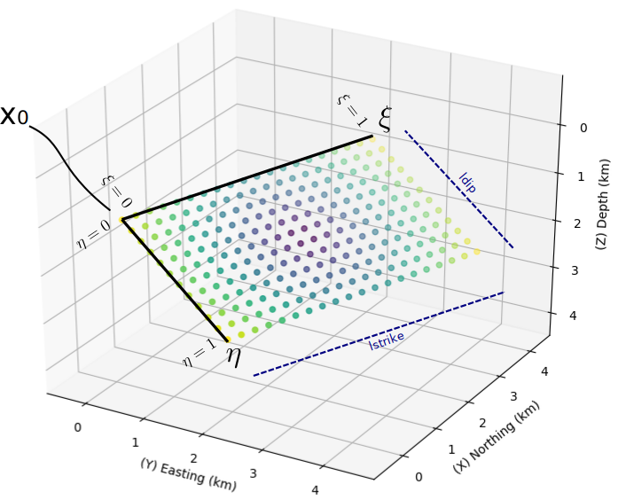

# Sources

A source is a point dislocation (`PointSource`) or a sum of them
(`FaultSource`). Both feed the same engine.

## Input: `PointSource`

```python
from shakermaker.pointsource import PointSource

source = PointSource([0, 0, 4], [90, 90, 0])   # location, [strike, dip, rake]
```

`PointSource(x, angles, stf=Dirac(), tt=0)`:

| Arg | Units | Meaning | Notes |
|---|---|---|---|
| `x` | km | location `[x, y, z]` | `z` positive **down** (depth) |
| `angles` | deg | `[strike, dip, rake]` | Aki–Richards convention |
| `stf` | – | [source time function](source_time_functions.md) | default `Dirac()` = bare Green's function |
| `tt` | s | trigger/rupture time offset | shifts the whole trace; key for finite faults |

**Mechanism cheat-sheet** (`[strike, dip, rake]`):

| Mechanism | Example angles |
|---|---|
| Vertical strike-slip | `[90, 90, 0]` |
| Pure dip-slip (normal) | `[0, 45, -90]` |
| Pure dip-slip (reverse/thrust) | `[0, 45, 90]` |

Drag the angles to see how `[strike, dip, rake]` move the hanging wall relative
to the footwall:

<iframe src="../../assets/strike_dip_rake.html"
        title="Interactive strike, dip & rake block model"
        width="100%" height="560" loading="lazy"
        style="border:1px solid var(--sm-hair); border-radius:10px; background:#fff;">
</iframe>

<small>Interactive 3-D model — drag to orbit, scroll to zoom.
[Open full screen](../assets/strike_dip_rake.html).</small>

## Input: `FaultSource`

A collection of `PointSource` objects = an extended fault. Each subfault
keeps its own location, mechanism, STF, and `tt` (rupture timing).

```python
from shakermaker.faultsource import FaultSource

fault = FaultSource([source], metadata={"name": "mainshock"})
```

`FaultSource(sources, metadata)`, `sources` is a list of `PointSource`;
`metadata` is a free dict (give it a `name`). Access: `fault.nsources`,
`for src in fault`, `fault.get_source_by_id(i)`.

### Building an extended rupture

Lay out subfaults programmatically, vary `x`, `angles`, `stf`, and `tt` to
encode geometry and rupture propagation:

```python
subs = [PointSource([xi, 0, zi], [30, 90, 0], stf=Brune(f0=1.0), tt=ti)
        for (xi, zi, ti) in layout]
fault = FaultSource(subs, metadata={"name": "planar-rupture"})
```

{ width=440 }
{ width=440 }

## Conventions

- **Coordinates:** `x`, `y`, `z` in km; `z` is **depth (positive down)**.
- **Angles:** degrees, Aki–Richards.
- A strike-slip source radiates strongly on the **transverse** component; a
  dip-slip source loads the **radial/vertical** components.

## Reference

[Sources API →](../api/sources.md)
